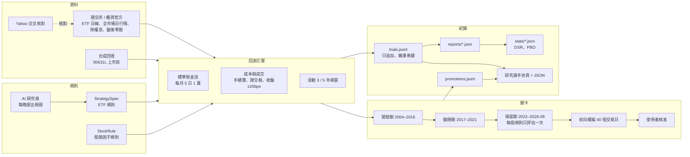
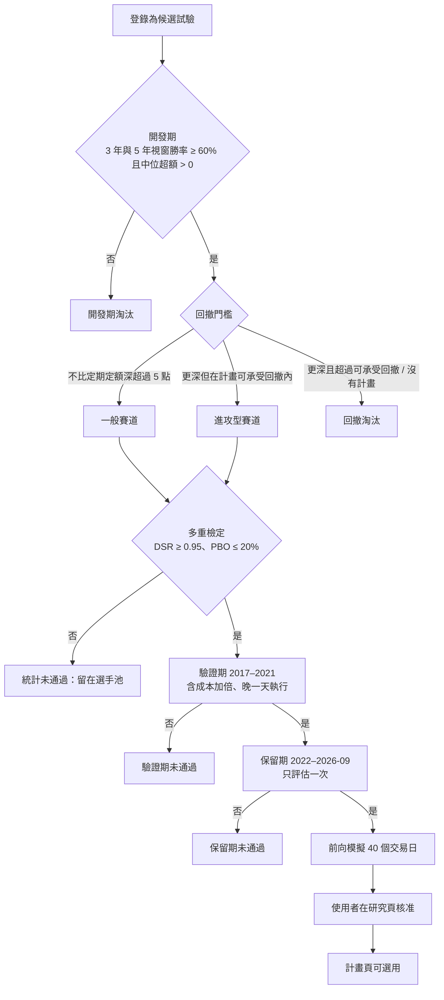

# 研究方法與研究路線圖

更新：2026-10-03。本檔是研究怎麼做、做到哪裡、接下來做什麼的唯一說明；每一個試過的規則與它的狀態在網站「研究 › 研究選手池」（`/research/pool`，機器可讀版 `/research/pool.json`）。數字以選手池與開發歷程為準，本檔的數字是 2026-10-03 的快照。

## 1. 研究要回答的問題

在相同的現金流、相同的成本、相同的盤後零股執行假設下，有沒有規則能長期勝過「每月 5 日把錢全部買進 0050」？規則必須事先寫成設定檔，不能指名個股；AI 是研究員，不是交易員；真實下單永久關閉。使用者 2026-10-03 的原則：只做上市股票、不借錢不融資、槓桿型 ETF 可以當工具、以投入的錢為主，風險由使用者在系統外控制。

## 2. 架構

模組：`research/history/`（資料）、`research/spec.py`（ETF 規則）、`research/stock_rules.py`（個股規則）、`research/engine.py` 與 `research/legacy_challenger.py`（回測）、`research/compare.py`（對基準）、`research/registry.py`（試驗登錄）、`research/significance.py` 與 `statistics.py`（檢定）、`research/promotion.py`（關卡與帳本）、`research/pool.py`（選手池）、`research/agent/`（AI 研究員）、`research/forward.py`（前向模擬）。

## 3. 資料

| 資料 | 來源 | 範圍 | 位置 |
|---|---|---|---|
| ETF 日線 18 個序列（0050、006208、0056、0051、0052、0053、0055、0057、00631L、00646、00662、00713、00878、00919、00679B、00687B、加權指數、報酬指數） | 證交所／櫃買官方，Yahoo 交叉核對 | 2004-02-11 起（各自上市日起） | `instance/research/history/daily/*.parquet` |
| 全市場上市普通股日行情（含後來下市的 179 檔） | 證交所每日收盤行情（MI_INDEX ALLBUT0999） | 2004-02-11～今，5,552 個交易日、470 萬列、1,261 檔 | `instance/research/history/stocks/twse/<年>.parquet` |
| 除權息、分割 | 證交所／櫃買除權息表；官方未註記的分割在目錄宣告 | 2003 起 | `history/raw/twse_ex_rights`、`actions.json` |
| 盤後零股成交分布與各限價成交率 | 證交所 TWT53U 抽樣 | 2010 起每 10 個交易日 | `history/odd_lot.json` |
| 00631L 上市前（2004–2014-10） | 合成：0050 含息日報酬 × 2 − 3.5%／年（成本校準自 2014–2026 真實追蹤差） | — | 標示 `synthetic`，manifest 有校準 |
| 櫃買個股 | 尚未（網站 2026-10-03 連不上） | — | 待做 |
| 財報、月營收、本益比 | 尚未（FinMind 免費等級有，每小時 600 次） | — | 待做 |

資料規則：研究用資料只讀；每日新增的行情不改變開發期的資料指紋；資料修正或目錄擴充後重跑，舊紀錄保留。

## 4. 比較方式

- 基準：每月 5 日投入 10,000 元，當天以盤後零股全部買進 0050；股利留到下次一起投入。另有「一次投入 30 萬、之後只換股」的模式供使用者看結果，不作為試驗。
- 超額 =（規則期末資產 − 基準期末資產）÷ 投入金額。全期與滾動 3 年、5 年視窗（每個月起算一次）都算；勝率 = 超額 > 0 的視窗比例；另看中位與最差視窗。
- 最大回撤以單位淨值算（排除新資金的影響）；XIRR 是資金加權報酬。
- 成本：手續費 0.1425%（保守估計每筆最低 20 元；國泰、台新最低 1 元，個股規則一律用國泰），賣出證交稅個股 0.3%、ETF 0.1%、債券 ETF 免；成交價＝收盤 ± 20 bps 進位到升降單位；今日建議的委託限價是收盤 ± 1%（只決定買不買得到）。
- 個股規則：可選股票須收盤 ≥ 10 元、近 20 日日均成交值 ≥ 2,000 萬元、上市 ≥ 252 個交易日；下市的股票以最後成交價計；期間前兩年暖機。

## 5. 規則怎麼寫、怎麼試

- ETF 規則（`StrategySpec`）：投入時點、投入金額倍數（均線、回撤）、固定配置與再平衡、趨勢控制（跌破均線改防守配置或現金）、ETF 輪動與核心＋衛星。
- 個股規則（`StockRule`）：單一或混合因子（12-1 月動能、6 月動能、1 月反轉、60 日低波動、接近 52 週高點、近 12 月殖利率，百分位排名加權）、前 N 名等權、每月或每季換股、緩衝（留到跌出前 N×倍數才賣）。
- 來源：事先固定的規則批次（ETF 三批 131 個；個股兩批 26 個、大掃描 492 個）、AI 研究員每晚最多 3 輪 12 個試驗（看不到驗證期與保留期）。
- 大掃描分兩階段：先只算全期間（幾秒一個），再對前 40 名算完整視窗並跑驗證期。
- 每個不同的規則都登錄為一次試驗，計入多重檢定（同一規則在新資料版本重跑只算一次；穩健性變體不算）。

## 6. 關卡

- 多重檢定：Deflated Sharpe Ratio 以「不同規則數」當試驗次數；PBO 以 CSCV 算。2026-10-03 累計 642 個不同規則，最佳 DSR 0.17，門檻 0.95——目前沒有規則通過統計門檻。
- 驗證期可以在統計門檻之外先跑（檢查規則是否只在開發期有效），但保留期只能跑一次，由使用者決定何時用。
- 前向模擬的結果只觀察，不用來挑規則。

## 7. 2026-10-03 的結論

- ETF 規則 131 個：時點、定期不定額、換標的、趨勢控制、ETF 輪動、核心＋衛星、板塊輪動——沒有一個同時通過視窗與統計門檻；最接近的是「每月 16／26 日買」（開發期 3 年勝率 71%，DSR 0.17）。槓桿型（00631L 固定比例）報酬高於基準但回撤深（全數定投 −84%），且對合成成本假設敏感。
- 舊版機器學習模型：排序訊號有資訊（5 日排序相關 0.03），但優勢來自 2026 年才選進股票池的小公司（倖存者偏差），用當時大型股重算就不贏。
- 個股規則 510 個：動能、反轉、高殖利率、低波動單獨都輸；**只有「接近 52 週高點」有效**。大掃描裡開發期最好的規則（混合三因子、每季換股，開發期 +100%～+129%）在驗證期多半輸 10%～26%——這是過度擬合的實況。
- **兩段獨立期間都贏的規則**：「接近 52 週高點、前 30 名、每月檢查、留到跌出前 90 才賣」——開發期 +22%（3 年勝率 84%、中位 +7%），驗證期 +27%（年化 28.4% 對 22.3%，勝率 76%、中位 +9.5%、最差 −16%），回撤都不比 0050 深；成本加倍後優勢大幅縮小（開發期 −10%、驗證期 +4.5%）。一次投入 30 萬：2005–2016 變 121 萬（0050 68 萬），2017–2021 變 83 萬（0050 71 萬）。保留期未用。

## 8. 已淘汰的方向與原因

| 方向 | 原因 |
|---|---|
| 投入時點（每月 6／16／26 日） | 差異在 0.1% 以內，統計上分不出 |
| 定期不定額（均線、回撤倍數） | 閒置現金拖累，3 年勝率 7%～65% |
| 0050 對 0056 輪動、板塊輪動 | 全部落後；台股板塊動能在 2008–2016 不存在，買最強板塊最差 |
| 趨勢控制（跌破均線改現金或防守） | 回撤變小但年化少 3～5 個百分點、換股成本高 |
| 核心＋衛星 | 略低於基準 |
| 個股 12-1 月動能、6 月動能、1 月反轉、高殖利率 | 開發期回撤 −70%～−80%，勝率 0%～35%；反轉與殖利率最差 |
| 個股低波動 | 回撤小但報酬輸 |
| 每季換股的 52 週高點（開發期最好） | 驗證期輸，判定為參數碰巧 |
| 舊版 ML 選股 | 倖存者偏差 |

## 9. 研究路線圖（給下一個接手的模型）

依序，每一包做完都要：登錄試驗、更新選手池、開發歷程、本檔第 7～8 節。

| 編號 | 工作包 | 內容 | 驗收 |
|---|---|---|---|
| R1 | 保留期決定 | 使用者決定是否對「52 週高點、前 30、每月、留緩衝」用掉唯一一次保留期；跑完記錄在選手池與開發歷程 | 帳本與選手池顯示結果 |
| R2 | 個股規則的前向模擬 | 每個交易日收盤後把全市場行情追加到 `stocks/twse/<年>.parquet`（`history stocks` 只抓缺的日子），用規則算當天的買賣與市值，寫入 `forward/stocks/log.jsonl`，研究頁顯示 | 40 個交易日紀錄完整、可對帳 |
| R3 | 成本與周轉 | 規則層：只在偏離目標超過門檻時才交易、每檔最小交易金額、季換股但月補新資金；量化費稅佔投入的比例 | 開發期與驗證期都仍贏且費稅 < 投入的 3% |
| R4 | 執行可行性 | 盤後零股在個股的成交率與成交價差（TWT53U 個股抽樣）；流動性門檻校準；委託單生成接到今日頁（個股規則核准後才需要） | 成交假設有個股資料支持 |
| R5 | 價值與品質因子 | FinMind 免費等級：本益比、淨值比、月營收、財報（注意公告時間，只用公告後的資料）；混入 52 週高點 | 時點一致；進開發期與驗證期 |
| R6 | 櫃買個股 | 櫃買每日行情納入股票池 | 同 R2 的格式 |
| R7 | 風險覆蓋 | 單檔上限、產業上限、整體跌破均線減碼——都當規則測，不另設例外 | 回撤與勝率的取捨有數字 |
| R8 | 核心＋個股衛星 | 0050 核心 + 個股規則衛星 20%～50% | 與純 0050、純個股比較 |
| R9 | 統計政策 | 家族式多重檢定（同一因子的參數變體算一個家族）、驗證期的 DSR；是否採用由使用者決定並寫入需求 §7 | 文件與程式一致 |
| R10 | 舊版 ML 重測 | 用無倖存者偏差的股票池重訓重測舊版模型 | 挑戰者評估更新 |
| R11 | 海外與槓桿 | 00646、00662 需美股指數代理；槓桿 ETF 固定比例是否列為內建風險選擇由使用者決定（不借錢） | 使用者決定 |
| R12 | 選手池與助理 | `/research/pool.json` 供助理查詢；每週研究報告加入個股規則；AI 研究員可提出個股規則 | 助理能回答「哪些被淘汰、為什麼」 |

## 10. 紀錄在哪裡

- 試驗登錄：`instance/research/trials.jsonl`（只追加、雜湊串鏈；`python -m quant_platform.research trials` 可列）
- 報告：`instance/research/reports/<期間>-…json`（含每月超額、視窗、設定檔）
- 統計：`instance/research/stats/development-*.json`
- 晉級帳本：`instance/research/promotions.jsonl`
- AI 研究日誌：`instance/research/journal.jsonl`；費用 `agent/usage.jsonl`
- 前向模擬：`instance/research/forward/log.jsonl`
- 舊版挑戰者：`instance/research/legacy/challenger-*.json`
- 網頁：研究頁（`/research`）、研究選手池（`/research/pool`、`/research/pool.json`）、本檔（系統頁 › 專案資訊 › 研究方法）
- 指令：`python -m quant_platform.research batch|stats|promote|legacy|stocks`、`python -m quant_platform.research.history fetch|build|actions|crosscheck|oddlot|stocks`（在專案根目錄以 `$env:PYTHONPATH="src"` 執行，避開 13:30–14:40）
