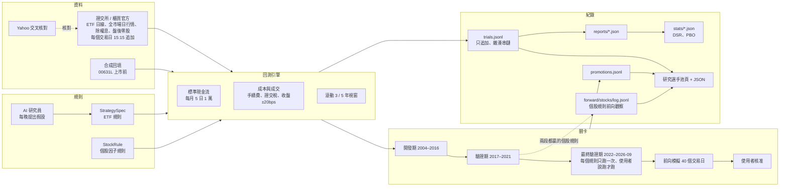
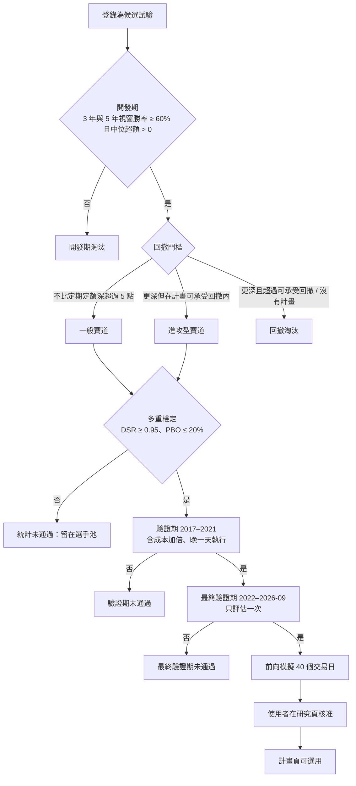
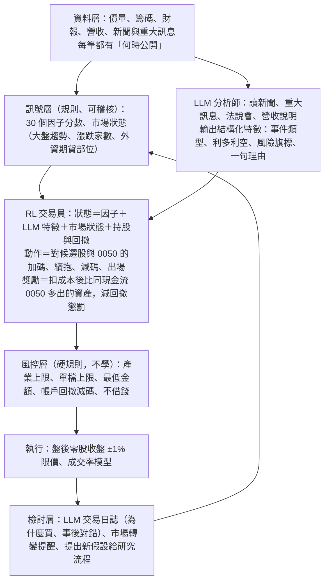

# 研究方法與研究路線圖

更新：2026-10-04。本檔是研究怎麼做、做到哪裡、接下來做什麼的唯一說明；每一個試過的規則與它的狀態在網站「研究 › 研究選手池」（`/research/pool`，機器可讀版 `/research/pool.json`）。數字以選手池與開發歷程為準，本檔的數字是 2026-10-04 的快照。

## 1. 研究要回答的問題

在相同的現金流、相同的成本、相同的盤後零股執行假設下，有沒有規則能長期勝過「每月 5 日把錢全部買進 0050」？規則必須事先寫成設定檔，不能指名個股；AI 是研究員，不是交易員；真實下單永久關閉。使用者 2026-10-03 的原則：只做上市股票、不借錢不融資、槓桿型 ETF 可以當工具、以投入的錢為主，風險由使用者在系統外控制。使用者 2026-10-04 決定實際配置：**每月投入的八成照定期定額買 0050，兩成走策略**；之後使用者說明策略帳戶的算法：先有啟動資金（先用 30 萬），之後每月定期定額投入，整個帳戶都可以買賣、獲利再投入；研究的主問題是「怎樣操作這個帳戶，才能比同樣的錢定期定額買 0050 滾得更多」。使用者也要求：不要只差一點參數的相似策略，要多種因子、自己找出哪個強哪個弱。

## 2. 架構

模組：`research/history/`（資料）、`research/spec.py`（ETF 規則）、`research/stock_rules.py`（個股規則）、`research/engine.py` 與 `research/legacy_challenger.py`（回測）、`research/compare.py`（對基準）、`research/registry.py`（試驗登錄）、`research/significance.py` 與 `statistics.py`（檢定）、`research/promotion.py`（關卡與帳本）、`research/pool.py`（選手池）、`research/agent/`（AI 研究員）、`research/forward.py`（ETF 前向模擬）、`research/stock_forward.py`（個股規則前向觀察）。

## 3. 資料

| 資料 | 來源 | 範圍 | 位置 |
|---|---|---|---|
| ETF 日線 18 個序列（0050、006208、0056、0051、0052、0053、0055、0057、00631L、00646、00662、00713、00878、00919、00679B、00687B、加權指數、報酬指數） | 證交所／櫃買官方，Yahoo 交叉核對 | 2004-02-11 起（各自上市日起） | `instance/research/history/daily/*.parquet` |
| 全市場上市普通股日行情（含後來下市的 179 檔） | 證交所每日收盤行情（MI_INDEX ALLBUT0999） | 2004-02-11～今，5,552 個交易日、470 萬列、1,261 檔 | `instance/research/history/stocks/twse/<年>.parquet` |
| 除權息、分割 | 證交所／櫃買除權息表；官方未註記的分割在目錄宣告 | 2003 起 | `history/raw/twse_ex_rights`、`actions.json` |
| 盤後零股成交分布與各限價成交率 | 證交所 TWT53U 抽樣 | 2010 起每 10 個交易日 | `history/odd_lot.json` |
| 00631L 上市前（2004–2014-10） | 合成：0050 含息日報酬 × 2 − 3.5%／年（成本校準自 2014–2026 真實追蹤差） | — | 標示 `synthetic`，manifest 有校準 |
| 櫃買個股 | 尚未（網站 2026-10-03 連不上） | — | 待做 |
| 財報、月營收、本益比 | 尚未（FinMind 免費等級有，每小時 600 次） | — | 待做 |
| 個股三大法人買賣超 | 證交所 T86、FinMind（2026-10-04 實測） | 2012-05-02 起（更早沒有） | 待做（R13） |
| 個股外資持股比率 | FinMind `TaiwanStockShareholding`（實測） | 2004-02-12 起 | 待做（R13） |
| 個股融資融券 | FinMind `TaiwanStockMarginPurchaseShortSale`（實測） | 2001 起 | 待做（R13） |
| 市場整體三大法人買賣金額 | 證交所 BFI82U（實測） | 2004-04-07 起 | 待做（R13） |
| 新聞、政治事件 | 沒有可回溯到 2004 年、標明當時何時公開的資料 | — | 無法回測；只能從現在起收集、前向觀察 |
| 下載中（2026-10-04 起）：外資持股、月營收、本益比／淨值比／殖利率、融資融券、三大法人 | FinMind 免費等級，每檔一次抓全歷史，每小時約 560 次，平日 13:30–15:30 暫停讓給每日流程 | 1,26x 檔 × 5 種，約 11 小時 | `history/raw/finmind/<資料集>/<代號>.json.gz`；進度在研究頁「執行中的程式」 |

資料規則：研究用資料只讀；每日新增的行情不改變開發期的資料指紋；資料修正或目錄擴充後重跑，舊紀錄保留。

## 4. 比較方式

- **策略帳戶的基準**（使用者 2026-10-04 決定，個股規則的主要比較）：先有一筆啟動資金（研究先用 30 萬），之後每月 5 日定期定額投入 1 萬；帳戶裡所有的錢（投入的加上賺賠的）都可以買賣、獲利再投入。比較對象是同樣的現金流（啟動資金＋每月）全部買 0050。滾動視窗也一樣：每個起點放 30 萬、之後每月 1 萬，3 年或 5 年後比。選手池預設用這個基準（`/research/pool`；`?basis=dca` 看每月投入、`?basis=lump_sum` 看一次投入）。
- 舊基準（2026-10-04 前的試驗、ETF 規則、八成定期定額那部分）：每月 5 日投入 10,000 元，當天以盤後零股全部買進 0050；股利留到下次一起投入。2026-10-04 前的「一次投入」試算，滾動視窗其實是每月投入算的（引擎 1.2.0 前的錯誤），不採用。
- 超額 =（規則期末資產 − 基準期末資產）÷ 投入金額。全期與滾動 3 年、5 年視窗（每個月起算一次）都算；勝率 = 超額 > 0 的視窗比例；另看中位與最差視窗。
- 最大回撤以單位淨值算（排除新資金的影響）；XIRR 是資金加權報酬。
- 成本：手續費 0.1425%（保守估計每筆最低 20 元；國泰、台新最低 1 元，個股規則一律用國泰），賣出證交稅個股 0.3%、ETF 0.1%、債券 ETF 免；成交價＝收盤 ± 20 bps 進位到升降單位；今日建議的委託限價是收盤 ± 1%（只決定買不買得到）。
- 個股規則：可選股票須收盤 ≥ 10 元、近 20 日日均成交值 ≥ 2,000 萬元、上市 ≥ 252 個交易日；下市的股票以最後成交價計；期間前兩年暖機。

## 5. 規則怎麼寫、怎麼試

- ETF 規則（`StrategySpec`）：投入時點、投入金額倍數（均線、回撤）、固定配置與再平衡、趨勢控制（跌破均線改防守配置或現金）、ETF 輪動與核心＋衛星。
- 個股規則（`StockRule`）：單一或混合因子（12-1 月動能、6 月動能、1 月反轉、60 日低波動、接近 52 週高點、近 12 月殖利率，百分位排名加權）、前 N 名等權、每月或每季換股、緩衝（留到跌出前 N×倍數才賣）；降低交易的設定（R3）：最短持有（新買的至少留幾次檢查，不再合格仍賣）、加碼門檻（低於目標超過幾成才加碼，缺口大的先買）、每筆最低金額。
- 因子庫（2026-10-04 擴充）：原本 6 個加上 3 個月動能、1 週反轉、1 年低波動、近 1 個月最大單日漲幅低、成交值大、成交值放大、站上 200 日均線幅度，共 13 個價格與成交因子；籌碼與基本面因子等 FinMind 資料下載完加入。
- 因子強弱分析（`research/factors.py`，`python -m quant_platform.research factors`）：每月 5 日把合格股票依因子排名，算和下個月報酬的排序相關（平均、t 值、正的月份比例）與前五分之一減後五分之一的報酬，分開發期、驗證期、最終驗證期、2020 年前後、2024 年後報告，判定強／不穩／弱／反向；研究頁「因子強弱」分頁。這是描述，不登錄為試驗。
- 每個個股規則都記錄交易量：費稅佔投入（整段期間手續費＋證交稅 ÷ 投入）、每年周轉率（一年賣出金額 ÷ 平均資產）、每年費稅佔平均資產、每月下單筆數。
- 來源：事先固定的規則批次（ETF 三批 131 個；個股兩批 26 個、大掃描 492 個、持有與加碼規則 40 個）、AI 研究員每晚最多 3 輪 12 個試驗（看不到驗證期與最終驗證期）。
- 大掃描分兩階段：先只算全期間（幾秒一個），再對前 40 名算完整視窗並跑驗證期。
- 每個不同的規則都登錄為一次試驗，計入多重檢定（同一規則在新資料版本重跑只算一次；穩健性變體不算）。

## 6. 關卡

- 多重檢定：Deflated Sharpe Ratio 以「不同規則數」當試驗次數；PBO 以 CSCV 算。2026-10-03 累計 679 個不同規則；ETF 規則最佳 DSR 0.17、個股規則最佳 0.02（`stats/stocks-development-*.json`，PBO 10%），門檻 0.95——目前沒有規則通過統計門檻。
- 驗證期可以在統計門檻之外先跑（檢查規則是否只在開發期有效）。最終驗證（2022–2026-09）每個規則只跑一次：跑過就等於看過答案，之後改規則再跑就不算數，所以使用者說「跑」才跑（2026-10-04 第一次跑，4 個規則）。
- 兩段期間都贏的個股規則自動進入前向觀察（R2），從加入那天起每個交易日記錄，不等最終驗證；這和關卡裡「前向模擬 40 個交易日」是同一份紀錄，但晉級仍要依序過關。
- 前向模擬的結果只觀察，不用來挑規則。

## 7. 2026-10-03 的結論

### 目前結論（網站研究總覽顯示這一段；最近更新 2026-10-09）

- **只看 100% 個股**（使用者 2026-10-09）：0050 是使用者自己另外持有的部位，「一半放 0050」之類的規則只是把它混進來、數字變好看，不是策略本身的本事。含 0050 的 72 個規則（包括之前的 5 個 T0 候選）全部不採用、停止前向觀察；之後只研究 100% 個股的規則。
- **大規模搜尋找到 10 個新的 T0 候選**（2026-10-10，`scan-1.0.0`：39,676 個候選只用 2015-06～2020-09 快篩，彼此不同的 80 個用完整引擎跑；2020-10 以後在挑選時完全沒看過）。最好的是「近 52 週高＋每股盈餘成長＋日內動能：前 20 名、同產業最多 3 成」（#2107）：2015-06 起 2,084 萬（0050 991 萬）、年化 35.1%（0050 24.8%）、2020-10 起 495 萬對 378 萬、1 年／3 年視窗勝率 75%／90%（3 年中位 +42.8%）、**最大回撤 −29.9%，比 0050（−34.0%）還淺**；每月超額 +0.78%（95% 區間 +0.05%～+1.75%，整段區間都在 0 以上）。持股 20 檔、台積電平均只佔 0.5%、和 0050 每天報酬的相關 0.59：不是變相的 0050。代價是交易多（每月約 19 筆委託、費稅約投入的 97%），而且 2024～2026 三年都輸 0050（−5%、−11%、−18%）。其餘 9 個見第 7 節「大規模搜尋」。上一輪的大型股 T0 候選（#2078）仍在。全部 10/12 15:30 起前向觀察。
- **追強勢股的規則回撤深是本質**：20 檔正在漲的股票會一起回落。使用者決定回撤門檻維持（不比 0050 深超過 5 個百分點）。到目前試過的賣出／減碼方式：15% 移動停損、大盤跌破 200 日均線、帳戶跌破自己的 200 日均線、學習出場、依自己的波動減碼到現金——都沒有在不犧牲更多報酬下把回撤壓進門檻。只挑低波動的股票回撤可以壓到 −23%，但報酬大輸 0050。
- **只在大型股裡挑**（2026-10-09）：市值前 100 大挑 20 檔（不放 0050、也不照市值比例）。大型股讓趨勢規則回撤變淺、成本降到三分之一以下（費稅佔投入 13%～17%，全市場版 32%～60%），代價是 2015–2019 小型股強的年份與 2024 台積電獨漲的年份落後。8 個規則：1 個 T0 候選（上一條）、3 個 T1（每檔等額的趨勢 1,477 萬、回撤 −44%；趨勢＋月營收年增 1,443 萬、回撤 −45%；機器學習＋趨勢各半 回撤 −39.2%）、其餘 T3。
- **因子**：價格趨勢類（站上 200 日均線、6 個月動能、52 週高點）與機器學習能贏 0050；反轉、低波動、價值殖利率、籌碼、營收財報單獨做都輸。月營收加速判定強，但做成 20 檔規則輸。
- **強化學習**：6 個版本都沒有贏過固定比例，結案；學個股出場分不出該賣哪一檔。最後一版（`rl-sleeves-2.0.0`，現金取代 0050、回撤懲罰加倍）平均放一半現金，年化 19.2%、回撤 −25%，等於固定「各 1/4、一半現金」（18.6%、−24%），輸 0050（25.0%）。
- **成本**：100% 個股的趨勢規則每月約 12～15 筆委託、費稅約投入的 32%～60%；機器學習每月約 30～37 筆、費稅約 113%～131%。
- **AI 的角色**（2026-10-09 起）：LLM 每晚把新聞標題整理成事件欄位，只用在「利空不買」與對照組的前向實驗（100% 個股版本）；AI 研究員每週提出最多 2 個 100% 個股的規則、只看 2015-06～2020-09，本身也有一個前向帳戶「AI 研究員（整體）」。
- **外部做法搬過來沒有用**（2026-10-10）：依台股量化公開做法與文獻事先登錄 6 個規則（營收公布後換股、趨勢連續性、日內動能、產業殘差動能、不買樂透型股票、FinLab 型四因子），全部沒過；最接近的是四因子（1,208 萬、兩段都贏 0050、回撤 −36.9%，但 1 年／3 年視窗勝率 43%／50%）。在這段台股，最簡單的「站上 200 日均線」仍是最好的訊號。
- **搜尋規模**（使用者 2026-10-10：沒測過上千上萬個方法不要說找不到，也不要用一樣的參數充數）：改成大規模兩階段搜尋（第 7 節「大規模搜尋」）。第一輪 39,676 個候選、1,363 個過快篩、80 個完整回測：10 個 T0 候選、6 個 T1、18 個 T2、46 個 T3。第二輪四個訊號一組（329,004 個候選，新的最後名單也要和第一輪的 80 個不同）背景執行中。統計記錄在選手池（238 個規則；PBO 0.23）。
- **買得到嗎（R4）**：盤後零股 80%～90% 在限價（收盤 ±1%）內成交、成交價中位數就是收盤；風險是漲停日的買單與委託量（帳戶大了整張改盤後定價）。

### 2026-10-03（舊設計）

- ETF 規則 131 個：時點、定期不定額、換標的、趨勢控制、ETF 輪動、核心＋衛星、板塊輪動——沒有一個同時通過視窗與統計門檻；最接近的是「每月 16／26 日買」（開發期 3 年勝率 71%，DSR 0.17）。槓桿型（00631L 固定比例）報酬高於基準但回撤深（全數定投 −84%），且對合成成本假設敏感。
- 舊版機器學習模型：排序訊號有資訊（5 日排序相關 0.03），但優勢來自 2026 年才選進股票池的小公司（倖存者偏差），用當時大型股重算就不贏。
- 個股規則 510 個：動能、反轉、高殖利率、低波動單獨都輸；**只有「接近 52 週高點」有效**。大掃描裡開發期最好的規則（混合三因子、每季換股，開發期 +100%～+129%）在驗證期多半輸 10%～26%——這是過度擬合的實況。
- **兩段獨立期間都贏的規則**：「接近 52 週高點、前 30 名、每月檢查、留到跌出前 90 才賣」——開發期 +22%（3 年勝率 84%、中位 +7%），驗證期 +27%（年化 28.4% 對 22.3%，勝率 76%、中位 +9.5%、最差 −16%），回撤都不比 0050 深；成本加倍後優勢大幅縮小（開發期 −10%、驗證期 +4.5%）。一次投入 30 萬：2005–2016 變 121 萬（0050 68 萬），2017–2021 變 83 萬（0050 71 萬）。費稅佔投入：開發期 23%、驗證期 13%（一年把整個組合換 4～6 次、每月約 28～38 筆委託）。
- **持有與加碼規則（R3，40 個規則，每月投入基準）**：這兩條是策略本身的規則（使用者 10/04 指正：不是「降成本」），交易變少只是副作用。19 個過開發期門檻（21 個因回撤比 0050 深超過 5 個百分點被擋），跑驗證期後只剩 3 個兩段都贏。最好的是「前 30 名、每月檢查、留到跌出前 90、新買的至少留 6 個月、落後目標三成以上才加碼、每筆至少 1,000 元」：開發期 +49%（3 年勝率 77%、中位 +8%，最大回撤 −60% 對 0050 −56%），驗證期 +18%（年化 26.3% 對 22.3%，3 年勝率 68%、中位 +8.7%、最差 −21%）；費稅佔投入從 23% 降到 11%（驗證期 13% → 4%），周轉從一年 4.1 次降到 1.9 次，委託從每月 28 筆降到 11 筆。只加「落後三成才加碼」的版本費稅幾乎不變（賣出才是成本大宗），但委託從 28 筆降到 22 筆。統計上仍不顯著：月超額平均 +0.41%，95% 區間 −0.13%～+0.98%，DSR 0.00。
- 教訓：單獨「最短持有 3 個月」或改成每季換股，開發期大幅變好（+39%～+96%），驗證期卻輸 5%～16%；放寬到前 150、前 250 才賣，回撤變深或驗證期輸。開發期越好看的設定越容易在驗證期輸，這和大掃描一樣是過度擬合。驗收目標「費稅 < 投入的 3%」沒有達到：費稅佔投入會隨資產變大而上升（12 年期間資產長到投入的 1.8 倍），只有一年換不到一次的設定才接近 3%，而它們都過不了門檻。
- 驗證期已經被用來篩選很多規則（R3 跑了 19 個），它不再是完全沒看過的資料；真正沒看過的只剩最終驗證（2022–2026-09）與 10/05 起的前向觀察。
- 兩段都贏的 4 個個股規則從 2026-10-03 起自動進入前向觀察（第一筆紀錄 10/05，當天是第一個投入日）。

### 最終驗證（2026-10-04，使用者說跑）

4 個兩段都贏的規則各跑一次 2022-01～2026-09（試驗 #1148～#1151，國泰手續費），**全部輸給 0050 定期定額**：

| 規則 | 期末（投入 57 萬） | 0050 | 比 0050 | 年化 | 3 年視窗勝率 |
|---|---|---|---|---|---|
| 52 週高點、前 30、每月、留到跌出前 90 | 128.6 萬 | 169.2 萬 | −71% | 35.4% 對 48.3% | 0／22 |
| 同上＋落後三成才加碼 | 130.2 萬 | 169.2 萬 | −69% | 36.0% | 0／22 |
| 同上＋新買的至少留 6 個月 | 113.2 萬 | 169.2 萬 | −98% | 29.6% | 0／22 |
| 52 週高點、前 50、每季 | 136.9 萬 | 169.2 萬 | −57% | 38.3% | 0／22 |

一次投入 30 萬（2022-01 起）：冠軍規則 91.7 萬，0050 103.5 萬。0050 在 2025-06 一拆四，基準的資產在分割前後連續（59.6 萬 → 60.1 萬），沒有算錯。

為什麼輸——不是規則在 2022–2023 失效，而是 2024 年起台積電獨漲：

| 年 | 冠軍規則比 0050（各月超額相加，約略的百分點） |
|---|---|
| 2020、2021 | +8、+14 |
| 2022（空頭，台積電跌） | +21 |
| 2023 | +12.5 |
| 2024 | −24 |
| 2025 | −18 |
| 2026 1–9 月 | −2.6 |

最終驗證期間台積電含息 +315%、0050 +246%、加權指數 18,500 → 47,940。0050 裡台積電權重很高；平均分配 30～50 檔的規則等於少押台積電，台積電一枝獨秀時一定追不上。開發期（台積電 +520%、0050 +127%）與驗證期（+294%、+137%）規則能贏，是因為那時中型股也一起漲。

### 因子強弱（2026-10-04，13 個價格與成交因子、259 個月）

看分數最高五分之一（規則只買前段）每年比所有合格股票平均、比 0050 多或少幾個百分點（未扣成本）：

| 因子 | 判定 | 比平均：開發／驗證／最終／2024 後 | 比 0050：開發／驗證／最終／2024 後 |
|---|---|---|---|
| 站上 200 日均線幅度 | 強 | +4.7／+8.9／+11.9／+14.7 | +5.7／+7.9／−2.9／−16.9 |
| 接近 52 週高點 | 強 | +7.3／+5.5／+9.4／+10.5 | +8.3／+4.6／−5.4／−21.1 |
| 6 個月動能 | 強 | +3.4／+6.7／+10.2／+12.9 | +4.4／+5.8／−4.6／−18.6 |
| 3 個月動能 | 強 | +3.8／+6.6／+8.3／+11.2 | +4.8／+5.7／−6.5／−20.3 |
| 成交值大 | 不穩 | −4.7／+3.9／+12.9／+21.8 | −3.6／+2.9／−1.9／−9.8 |
| 殖利率、低波動、反轉、不追飆股 | 弱或不穩 | 2017 年後前段都輸平均 | 最終驗證期每年輸 17～21 |

- 趨勢與動能類（200 日均線、52 週高點、3／6 個月動能）在三段期間選出的股票都比一般股票會漲，是最穩的因子；殖利率與低波動整體排序準（排序相關 t 3～4），但前段在 2017 年後反而落後。
- **但 2022 年起，所有因子的前段都輸 0050**，2024 年後每年輸 10～41 個百分點：0050 被台積電帶著漲，比一般股票多得太多。只換股不持有台積電（或 0050），在這種市場一定追不上。
- 所以下一步不是再找更強的單一因子，而是讓策略帳戶保留 0050／台積電的權重（核心），只用趨勢與動能因子決定加碼哪些股票或何時調整比重；也要試市值或成交值加權，而不是等權。

### 期間切分合理嗎（使用者 2026-10-04 問：疫情後市場大不同）

- 切分本身沒有偷看：開發 2004–2016、驗證 2017–2021、最終驗證 2022–2026-09。疫情後的市場剛好全在最終驗證期，所以這次最終驗證就是在回答「新市場還有沒有用」——答案是沒有。
- 真正的分水嶺不是疫情本身（2020、2021 規則還贏），而是 2024 年起的 AI 行情讓指數集中在台積電。用 2004–2016 找到的「中型股輪動」型規則，假設的市場結構已經變了。
- 弱點：開發期資料老（13 年前到 25 年前）；最終驗證期只有 4 年 9 個月，22 個 3 年視窗彼此重疊，實際上只算一兩個獨立樣本；而且被一檔股票主導。
- 現在三段歷史都看過了。之後新規則不能再宣稱 2022–2026 是「沒看過的資料」（研究者已經知道台積電獨漲），唯一真正沒看過的是 10/05 起的前向觀察。之後的做法（R9）：每個新規則都分「2020 前／2020 後」「含／不含台積電」報告；以「0050 核心＋衛星」為主要比較對象，而不是用 30 檔取代 0050（R8）。

## 8. 已淘汰的方向與原因

| 方向 | 原因 |
|---|---|
| 投入時點（每月 6／16／26 日） | 差異在 0.1% 以內，統計上分不出 |
| 定期不定額（均線、回撤倍數） | 閒置現金拖累，3 年勝率 7%～65% |
| 0050 對 0056 輪動、板塊輪動 | 全部落後；台股板塊動能在 2008–2016 不存在，買最強板塊最差 |
| 趨勢控制（跌破均線改現金或防守） | 回撤變小但年化少 3～5 個百分點、換股成本高 |
| 核心＋衛星 | 略低於基準 |
| 個股 12-1 月動能、6 月動能、1 月反轉、高殖利率 | 開發期回撤 −70%～−80%，勝率 0%～35%；反轉與殖利率最差 |
| 個股低波動 | 回撤小但報酬輸 |
| 每季換股的 52 週高點（開發期最好） | 驗證期輸，判定為參數碰巧 |
| 52 週高點加「最短持有 3 個月」或改每季換股（R3） | 開發期 +39%～+96%，驗證期輸 5%～16% |
| 52 週高點放寬到跌出前 150／250 才賣（R3） | 開發期回撤比 0050 深 5 個百分點以上，或驗證期 3 年勝率 12%～52% |
| 舊版 ML 選股 | 倖存者偏差 |
| 用 30～50 檔等權個股取代 0050（52 週高點全族，2026-10-04 最終驗證） | 2024 年起台積電獨漲，2022–2026 輸 0050 57%～98%；只有 2022–2023 贏 |
| 趨勢規則加上櫃股票（R6，2026-10-05） | 期末變少、回撤變深（−45% → −55%）；上櫃小型股只多波動 |
| 趨勢規則加 15% 移動停損（R7，2026-10-05） | 交易筆數變 2.4 倍、期末輸 0050、回撤沒變小 |
| 趨勢規則加大盤 200 日均線濾網（R7，2026-10-05） | 最深的回撤是熱門股自己崩跌、大盤沒跌，濾網擋不到；空手 680 天、期末少三分之一 |
| 趨勢規則加「帳戶跌破自己的 200 日均線就換 0050」（R7b，2026-10-06） | 訊號太慢、換過去 0050 也在跌、反覆換進換出；期末輸 0050，回撤反而 −58% |
| 機器學習用報酬「排名」當標籤（gbm-1.0.0，2026-10-06） | 學成防守型（低波動、高殖利率），IC 為正但前 20 名追不到大漲股，大輸 0050；改用超額報酬標籤 |
| 單一財報因子做 20 檔規則（2026-10-06） | 10 個全部 T3：財報一季才變一次，選到的多是高品質但不漲的股票；只在機器學習模型裡當特徵 |
| RL 調整個股／0050 比例（rl-overlay-1.0.0，2026-10-06） | 樣本外年化 26.4%，輸固定一半 0050（33.0%）；下跌年少賠、上漲年跟不上，每年換 26～79 次 |
| RL 調整部位、換部位更貴（rl-overlay-1.1.0，2026-10-07） | 年化 31.2%，仍輸固定一半 0050（32.9%），回撤只少 3 點；學到的接近固定一半 |
| RL 在家族間分配（rl-sleeves-1.0.0、1.1.0，2026-10-09） | 等於固定「各 1/4、一半 0050」（32.2% 對 32.1%）；RL 在本平台 5 個版本都沒有贏過固定比例，結案 |
| 依自己的波動減碼到現金（vol_scale v1，2026-10-09） | 回撤只淺 4 點、期末少三分之二；三個規則全 T3 |
| 「更好的動能」：趨勢連續性、日內動能、產業殘差動能（2026-10-10） | 文獻與台股研究支持，但在 2015–2026 都輸單純的站上 200 日均線（T3） |
| 營收公布後每月換股（2026-10-10） | 大型股趨勢骨架改成月換後從 1,151 萬掉到 892 萬（T3） |
| 不買樂透型股票（高特質波動、近月暴漲，2026-10-10） | 擋掉真正的贏家，期末少四成、回撤只淺 2 點（T2） |
| 只挑低波動的股票（趨勢或機器學習＋低波動，2026-10-09） | 回撤 −22%～−23%，但大輸 0050（T3） |
| 月營收加速單獨做規則（2026-10-09） | 強弱分析判定強，但前段比 0050 少；20 檔每週換股 −408%（一半 0050 −217%），T3 |
| 機器學習預測 60 日（gbm-1.3.0，2026-10-09） | 成本降一半，但前 20 名挑不出領先股，兩個規則都輸 0050（T3） |
| 學習個股出場（exit-1.0.0，2026-10-07） | 樣本外分不出該賣哪檔（10 年只有 4 年賣掉的比留著的差，平均差距 0.6%＝一趟成本）；每天照模型賣，每月 384 筆委託，帳戶被成本磨光（43 萬、回撤 −100%） |

## 9. 研究路線圖（給下一個接手的模型）

**2026-10-04 使用者指正**：策略每天都可以交易，不該只在每月 5 日；2005 年的市場制度（漲跌幅 7%、集合競價、沒有當沖與盤中零股）和現在差很多，不該拿來挑規則。研究重新設計見路線圖 S9-W02：以 2015-06 之後挑規則、另外檢查 2020-10 之後、每天都能決策、滾動前進評估；2015 年以前只當壓力測試參考。下面 R1–R16 依新設計重做。

### AI 方法評估（2026-10-09）

使用者問：有了 AI 之後哪些方法績效還不錯、AI 跟交易怎麼結合（例如 AI 代理交易）。完整報告：[AI 交易方法 實證與架構](../reports/AI%20交易方法%20實證與架構.md)（系統頁專案資訊「AI 方法評估」；筆記在 `research_notes/AI 交易方法 實證與架構/`）。結論：在嚴格樣本外（模型截止日之後、獨立重測、扣成本）站得住的只有橫斷面機器學習與 LLM 讀新聞產生訊號，淨效果都小；LLM 交易代理、LLM 自動挖因子、時間序列基礎模型、深度強化學習在獨立重測或真錢比賽都沒有穩定贏被動基準。本平台的架構：量化引擎做決定，LLM 只提供可稽核的輸入（事件欄位、說明、稽核），硬規則把關，使用者自己下單。期望值排序：① 機器學習改預測 60 日（gbm-1.3.0，2026-10-09 執行：成本降一半但兩個規則都 T3，未通過）② LLM 事件特徵（上表 D 段）③ AI 研究員改造後重開（稽核、寫程式、少量事先登錄的假設，全部進試驗帳；等使用者決定）④ 波動度預測先對 HAR ⑤ LLM 寫委託說明 ⑥ RL 結案 ⑦ LLM 代理直接下單不做。LLM 元件的評估規約：模型讀過的歷史一律算樣本內；即時評分存檔；遮名稱不算防護；防漏靠工具設計（故意偷看的策略也能通過 DSR、PBO）；每個提示詞版本、模型、門檻都進試驗帳。

### RL＋LLM 選股專家架構（提案，2026-10-04）

使用者問：能不能做一個像資深交易高手的 RL＋LLM 選股專家。評估如下，尚未實作。

**資料盤點（2026-10-04）**

| 資料 | 狀態 |
|---|---|
| 上市股每日價量（2004 起、含下市）、ETF 18 檔、除權息 | 有，每天自動更新 |
| 外資持股、融資融券、本益比／淨值比、月營收（上市，2001～2005 起） | 有 |
| 三大法人買賣超（2012-05 起）、產業別 | 有 |
| 上櫃個股股價 | 有（2026-10-05）：FinMind `TaiwanStockPrice` 2000 起、1,068 檔（含下市），`history/stocks/tpex/`；之後每天由櫃買官方行情追加 |
| 季財報（損益 2000 起、資產負債 2012 起） | 有（2026-10-06）：上市＋上櫃 2,613 檔的損益表與資產負債表；現金流量表下載中。五個財報因子以法定公告期限隔天才能用（`research/fundamentals.py`） |
| 期貨法人未平倉（台指期 2018 起）、下市清單 | 缺；FinMind 免費可補 |
| 新聞、重大訊息、法說會 | 歷史拿不到（FinMind 新聞不能查一段期間）；只能從現在起每天收集 |
| 盤後零股個股成交率、盤中分鐘資料 | 缺（R4；分鐘資料不在研究範圍） |

**架構（六層）**

**強化學習的訓練量（使用者 2026-10-05 問：每次訓練交易不同，等於不同情境，應該也算訓練次數）**：對一半。RL 每一回合做的決定不同，會走出不同的持股、現金與成本路徑，這些確實是新的訓練樣本，可以學「自己的動作會造成什麼結果」（何時出場、部位多大、交易成本）。但市場本身每一回合都是同一段歷史：2015-06 起約 2,700 個交易日、每天約 600 檔可選股票，股價怎麼走不會因為訓練次數變多而改變。訓練回合越多，越容易把「哪一天哪一檔會漲」背下來。所以訓練時要打散情境（隨機起點與長度、每回合隨機抽一部分股票、區塊重抽歷史報酬、加入雜訊），而判斷好壞一律用沒看過的期間（滾動前進的測試段）與前向觀察。

**兩個最大的風險**

1. LLM 的「事後之明」：語言模型訓練時已經讀過 2015～2025 年發生的事（哪家公司後來大漲、哪家出事），拿它回測歷史會偷看答案。所以 LLM 的部分不能用歷史回測證明，只能從現在起前向收集、前向評估；它在歷史回測裡只能做不需要判斷的事（例如把文字整理成類別）。
2. 強化學習容易背答案：2015-06 起約 2,700 個交易日、相鄰幾天高度相關，交易成本又大（買賣一趟約 1%）。對策：不從零學，而是疊在已知有效的趨勢規則上（只學加碼、減碼、出場的調整）；動作少、限制由風控層執行；滾動前進訓練；多個隨機種子；必須在驗證與前向觀察贏過 T1 趨勢規則才算數。

**分段做法與驗收**

| 段 | 內容 | 驗收 |
|---|---|---|
| A 補資料（2026-10-05 開始） | 上櫃股價、季財報（上市＋上櫃）、上櫃籌碼、期貨法人部位、下市清單（FinMind 免費，背景下載 `scripts\\research-pipeline.ps1 -Name data-a`）；新聞從 10/05 起每個交易日 14:40 收集前一個交易日（成交值前 150 檔與前向觀察持股，`research/news.py`） | 時點一致；上櫃納入股票池 |
| B 監督式基準（2026-10-06：`research/model.py`，`gbm-1.0.0` 排名標籤 T3、`gbm-1.1.0` 超額報酬標籤 T2、`gbm-1.2.0` 含財報的一半 0050 版是第一個 T0 候選，結果見第 7 節） | 30 個因子在當天合格股票中的百分位當特徵、之後 20 個交易日報酬的排名當標籤，每週一筆樣本；每年一個梯度提升模型（scikit-learn `HistGradientBoostingRegressor`，設定事先固定），只用標籤在那一年之前就結束的樣本訓練；分數當成因子 `ml_gbm`，規則照分數選前 20 名（同產業最多 3 成；全部或一半 0050；等額或依波動度配置，4 個規則）；樣本外診斷（每週 IC、前五分之一的排名差）在 `research/models/gbm-1.0.0/meta.json`；財報因子下載完加入成下一版 | 跟 T1 趨勢規則同門檻比較；這是 RL 要贏的對手之一 |
| C RL 交易員（C1 部位調整 2026-10-06：`research/rl.py`，`rl-overlay-1.0.0` 未通過驗收；2026-10-07 `rl-overlay-1.1.0` 換部位更貴、C1b 學習個股出場 `exit-1.0.0` 都未通過；2026-10-09 C3 `research/rl_sleeves.py`（`rl-sleeves-1.0.0`、`1.1.0`）在三個家族之間每天分配，等於固定比例，未通過；C 段結案，見第 7 節） | 環境就是現有每天決策引擎；先學出場與部位大小。C1：底層是最好的 T1 規則（站上 200 日均線、前 20 名、同產業最多 3 成、依波動度配置），RL 每個交易日收盤後只決定個股佔帳戶 0%／50%／100%（其餘 0050，每移動 100% 成本 0.5%）；獎勵＝當天比 0050 多的對數報酬減一半的回撤加深；狀態＝規則帳戶與 0050 的 5／20／60 日報酬、20 日波動、250 日回撤、兩者差距、站上 200 日均線比例、加權指數比 200 日均線、目前部位與帳戶回撤（只用訓練年份正規化）；PPO、隨機起點 250 個交易日、狀態加雜訊、設定事先固定；滾動前進（預測 Y 年只用 Y 年以前訓練）、5 個種子平均；合成資料的固定情境測試學得出來（樣本外 +139% 對一直持股 −10%）。C1b：每天對每檔持股預測「留著比換成規則的下一名多賺多少」（之後 20 個交易日、12 個收盤時已知的狀態、逐年滾動訓練的梯度提升），少於一趟成本 0.6% 就賣、20 個交易日內不買回 | 滾動前進的測試段（2017 起）贏 T1 規則、回撤不更深 |
| D LLM 分析師（2026-10-09 使用者同意、上限每月 5 美元；`research/news_events.py`、worker 21:45；否決與對照兩個帳戶 10/12 起前向） | 每天替收集到的**全部**新聞與重大訊息（約 150 檔，不只候選股）評分成事先固定的欄位：事件類型（財測、股利、營收、併購或處分、訴訟或違約、處置或警示、人事、產品、其他）、利多或利空、有沒有具體數字、比預期好或差、風險旗標；當天存成 Parquet、記錄模型版本，換模型只往後用、不回頭重算。先事先登錄一條利空否決規則（例如出現重大利空旗標的股票不買、持股提前檢查），同一引擎並排跑「有否決」與「沒否決」兩個影子帳戶；只觀察、不決策。估計每月 5～30 美元（批次 API 夜間跑） | 評估一年（假設每週 IC 0.03、標準差 0.10，約 44 週 t 才到 2）：事件分數的每週 IC、被否決的股票之後的表現；夠強才變成模型特徵 |
| E 整合（2026-10-09 修正：RL 那一層三次都贏不了固定比例，改用現有引擎） | 梯度提升模型與組合帳戶做決定＋LLM 事件否決（只能刪除或延後，不能新增股票或改金額）＋硬風控；LLM 另外寫每筆委託的說明與交易日誌 | 前向觀察 60 個交易日不輸 0050 → T0；60 天只能確認「沒壞」，超額要更長的前向紀錄 |

### 新設計（2026-10-04 起，`research/daily.py`）

- 期間：2015-06-01～2026-09-30 挑規則，2020-10-26～2026-09-30 另外重算一次；2015 年以前不用來挑規則。
- 帳戶：啟動資金 30 萬、每月 5 日 1 萬，整個帳戶都能買賣；比同樣現金流買 0050。
- 決策：每個交易日收盤後把合格股票依因子排名（一個或多個因子，百分位相加，負的權重表示反過來用）；持股跌出前 N × 保留倍數、而且已持有至少 20 個交易日才賣；新進榜的當天買；已持有的只在投入日加碼；每筆至少 1,000 元；可設一部分（例如一半）一直放 0050。
- 因子：13 個價格與成交因子加 6 個技術指標（均線交叉 20／60、RSI 14、MACD 柱狀體、KD 的 K 值 9 日、布林通道 %B、接近 55 日高點），共 19 個；RSI、KD、布林也測反向（買超賣）。籌碼與基本面下載完再加。
- 門檻：2015-06 起與 2020-10 起都贏 0050；滾動 3 年視窗勝率 ≥ 60% 且中位為正；1 年視窗勝率 ≥ 50%；最大回撤不比 0050 深超過 5 個百分點。過門檻的規則自動進入前向觀察。
- 因子強弱（新設計版）：每週排名一次，看之後 20 個交易日；分 2015-06 起、2015-06～2020-10、2020-10 起、2024 起報告（`python -m quant_platform.research factors --recent`）。
- 第一批（`daily --name factors`）：每個因子一個規則（前 20 名），再加一半放 0050 的版本，共 44 個；只差因子、不做參數微調。

**2026-10-04 結果（新設計第一批）**

因子強弱（每週排名、看 20 個交易日，前段比平均每年）：趨勢與動能類最強——站上 200 日均線 +10.4%、52 週高點 +10.0%、6 個月動能 +8.8%、RSI +8.1%、3 個月動能 +7.9%，2015–2020 與 2020 年後都成立；技術指標 KD、均線交叉、布林、55 日突破、MACD 也是正的但較弱；低波動、殖利率、反轉、不追飆股在近期是反向（前段比平均少 3～5 個百分點）。2024 年後所有因子的前段仍輸 0050。

規則（啟動資金 30 萬＋每月 1 萬，2015-06 起投入 166 萬）：44 個都沒有全部過門檻。最接近的兩個只差回撤：

| 規則 | 2015-06 起期末 | 0050 | 2020-10 起比 0050 | 1 年／3 年視窗勝率 | 最大回撤（0050） | 年化（0050） |
|---|---|---|---|---|---|---|
| 站上 200 日均線、前 20 名 | 1,652 萬 | 991 萬 | +39% | 60%／78% | −52%（−34%） | 31.9%（24.8%） |
| 同上、一半放 0050 | 1,333 萬 | 991 萬 | +49% | 60%／81% | −42%（−34%） | 28.9%（24.8%） |

- 逐年比 0050（百分點）：2015 +4、2016 −20、2017 +34、2018 −13、2019 +9、2020 +39、2021 +53、2022 +18、2023 +24、2024 +3、2025 −25、2026（1–9 月）+14。
- 回撤的來源：追趨勢會集中在同一個熱門類股；2026-07 持有的被動元件股（國巨、華新科、禾伸堂、大毅等）一個月跌 26%～61%，帳戶從 2,069 萬跌到 1,215 萬（加權指數同月 −6.5%）。檢查過不是資料錯誤（沒有除權息或分割調整，是類股崩跌）。
- 一半放 0050 把回撤從 −52% 降到 −42%，2020-10 起反而多賺；費稅佔投入從 49% 降到 17%。
- 6 個月動能（1,317 萬、一半 0050 1,197 萬）、成交值大（1,065 萬～1,085 萬，2020-10 起 +78%～+136%，但視窗勝率不到一半）次之。
- 注意：這 44 個規則和因子強弱都用同一段資料，最好的結果一定偏樂觀；兩個只差回撤的規則已加入前向觀察（2026-10-04 起，標示「只差回撤門檻」），以真實行情判斷。是否接受 −42%～−52% 的回撤由使用者決定（計畫頁的可承受回撤，或直接告知）。
- 下一步：限制同一類股的比重（產業上限，R7）、趨勢＋流動性的混合、核心比例，看能不能把回撤壓到門檻內而不犧牲報酬；籌碼與基本面下載完加入。

**選手池分級與產業上限（2026-10-04，使用者要求）**

分級：T3 輸 0050；T2 只有部分期間贏；T1 兩段都贏、視窗也夠但回撤比 0050 深超過 5 個百分點；T0 候選全部門檻都過；T0 再加前向觀察滿 60 個交易日仍不輸 0050。

產業上限（`risk` 批次，8 個規則）：

| 站上 200 日均線、前 20 名 | 2015-06 起期末（0050 991 萬） | 2020-10 起比 0050 | 1 年／3 年視窗勝率 | 最大回撤（0050 −34%） | 等級 |
|---|---|---|---|---|---|
| 不設上限 | 1,652 萬 | +39% | 60%／78% | −52% | T1 |
| 同產業最多 3 成 | 1,794 萬 | +32% | 60%／82% | −45% | T1 |
| 同產業最多 2 成 | 2,064 萬 | +106% | 63%／78% | −50% | T1 |
| 一半放 0050 | 1,333 萬 | +49% | 60%／81% | −42% | T1 |
| 一半放 0050、同產業最多 3 成 | 1,431 萬 | +23% | 62%／84% | −39.0% | T1（門檻 −39.0%，差不到 0.1 個百分點） |
| 一半放 0050、同產業最多 2 成 | 1,526 萬 | +58% | 63%／85% | −41% | T1 |

- 產業上限讓報酬變高、回撤變小，但回撤不隨上限單調變化（上限改變了選到的股票）。52 週高點加上限反而輸 0050；趨勢＋成交值大 1,078 萬～1,170 萬。
- 停止繼續微調參數（每多試一組就多一次碰巧的機會）。再降回撤要換機制：帳戶或市場跌破某條件時減碼（R7 風險覆蓋），或籌碼與基本面因子加入後重組。
- 所有 T1 規則自動進入前向觀察（下一個交易日 15:30）。

**籌碼與基本面因子（R13，2026-10-04）**

資料：FinMind 免費等級 1,261 檔 × 5 種（外資持股、本益比／淨值比、融資融券、三大法人、月營收），6,305 次請求、0 錯誤，整理成 `history/chips/*.parquet`（`python -m quant_platform.research.history chips`）。時點：外資持股、法人、融資、本益比當天晚上才公布，用前一個交易日的值；月營收用公告日（`create_time`）隔天起，沒有公告日的用次月 11 日。新增 11 個因子（共 30 個）：外資持股比率、外資持股增加、外資買超、投信買超、融資增加、券資比、本益比倒數、淨值比倒數、月營收年增、近 3 個月營收年增、市值。

| 因子 | 判定 | 前段比平均：2015-06 起／2015–2020／2020-10 起／2024 起 |
|---|---|---|
| 融資餘額增加 | 強 | +7.3／+5.2／+9.2／+10.3 |
| 月營收年增率 | 強 | +6.7／+5.5／+7.9／+11.4 |
| 近 3 個月營收年增 | 強 | +5.4／+4.5／+6.3／+11.7 |
| 投信買超 | 強 | +4.5／+4.5／+4.4／+4.7 |
| 外資買超、外資持股增加 | 弱 | 2020 前約 0，2020-10 起 +9～+10，2024 起 +15 |
| 市值（大型股） | 不穩 | 2020 前 −3，2020-10 起 +5.5，2024 起 +11.6 |
| 本益比倒數、淨值比倒數 | 弱 | 0 到 −4 |

- 但做成規則（前 20 名、每天）26 個全部是 T3：籌碼數字每天變，前 20 名一直換，費稅和雜訊吃掉優勢；因子分析的前五分之一約 120 檔、每週換一次，兩者不同。
- 趨勢加籌碼確認（同產業最多 3 成）：趨勢＋月營收年增 1,571 萬、2020-10 起多 125%，但回撤 −54.5%（T1，沒有比單純趨勢好）；趨勢＋投信買超、趨勢＋外資買超是 T3（費稅佔投入 68%～80%）。
- 統計（`stats --family daily`，84 個每天決策規則）：最好的「站上 200 日均線、同產業最多 2 成」月超額平均 +1.15%，95% 區間 −0.15%～+2.78%，DSR 0.00；PBO 9%（不太像從一堆規則裡碰巧挑到）。報酬大但波動也大，11 年的資料還不足以在統計上確認；答案要看前向觀察。
- 目前最好的仍是「站上 200 日均線、前 20 名、同產業最多 3 成」（1,794 萬、回撤 −45%，T1）。

**資料版本修正（2026-10-05）**：每天決策規則的資料版本原本會每晚改變（0050 序列與今年的除權息檔每天 15:15 重寫，連帶整份檔案的雜湊改變），所以 `stats --family daily` 找不到目前版本的試驗、重跑也不會沿用。改成只計算期間內（到 2026-09-30）的內容，並加入籌碼資料。全部每天決策規則在新版本上重跑：84 個舊規則的期末、回撤、2020-10 起與交易筆數和 10/04 完全相同。

**上櫃與風險控制（R6、R7，2026-10-05）**

都以目前最好的「站上 200 日均線、前 20 名、同產業最多 3 成」為底，設定事先固定：

| 規則 | 2015-06 起期末（0050 991 萬） | 2020-10 起比 0050 | 1 年／3 年視窗勝率 | 最大回撤（0050 −34%） | 等級 |
|---|---|---|---|---|---|
| 只有上市（原規則） | 1,794 萬 | +32% | 60%／82% | −45% | T1 |
| 上市＋上櫃 | 1,338 萬 | −37% | 65%／66% | −55% | T2 |
| 一半放 0050（原規則） | 1,431 萬 | +23% | 62%／84% | −39% | T1 |
| 一半放 0050、上市＋上櫃 | 1,289 萬 | +3% | 68%／74% | −43% | T1 |
| 加權指數跌破 200 日均線就空手 | 1,232 萬 | +76% | 53%／58% | −46% | T2 |
| 同上、一半放 0050 | 1,219 萬 | +58% | 56%／71% | −40% | T1 |
| 跌離買進後高點 15% 停損 | 792 萬 | −130% | 44%／62% | −51% | T3 |
| 同上、一半放 0050 | 897 萬 | −67% | 45%／66% | −39% | T3 |
| 停損＋指數濾網 | 902 萬 | −76% | 46%／52% | −45% | T3 |
| 同上、一半放 0050 | 1,002 萬 | −33% | 50%／56% | −36% | T2 |

- 上櫃（R6）：三個趨勢家族加上上櫃後都變差（趨勢 1,794 → 1,338 萬、回撤 −45% → −55%；趨勢＋成交值大 1,170 → 1,099 萬；52 週高點仍輸 0050）。對追趨勢的規則，上櫃小型股帶來的是波動不是報酬。規則預設維持只有上市；上櫃資料留著，給之後營收、財報類的因子用。
- 回撤從哪來：趨勢規則最深的幾次回撤，都是持股自己崩跌、大盤沒怎麼跌——濾網版 2021-07-08 → 2022-01-26 帳戶 −46%，加權指數 −1%（航運、鋼鐵等熱門股回落）；原規則 2018-06 → 2019-05 −43%，加權指數 −6%。所以看大盤的濾網擋不到：它讓帳戶 680 個交易日空手、期末少三分之一，回撤沒有變小。
- 停損：交易筆數 1,823 → 4,365，期末輸 0050，回撤也沒有變小。推測原因是趨勢股波動大，跌 15% 後常再漲回，停損賣在低點、20 個交易日不買回又錯過反彈（未逐筆驗證）。
- 唯一回撤進門檻的是「停損＋指數濾網、一半放 0050」（−36%），但 2020-10 起輸 0050 33%，等於回到買 0050。
- 統計（`stats --family daily`）：只有上市的 90 個規則最好 DSR 0.00、PBO 0.11；上市＋上櫃 6 個 PBO 0.19。
- 結論：要壓回撤得看「持股本身」，不是大盤。目前有效的只有 0050 核心比例（−45% → −39%）和產業上限。

**看持股本身的兩個機制（R7b，2026-10-06，使用者說繼續研究）**

| 規則（站上 200 日均線、前 20 名、同產業最多 3 成） | 2015-06 起期末（0050 991 萬） | 2020-10 起比 0050 | 1 年／3 年視窗勝率（3 年中位） | 最大回撤（0050 −34%） | 費稅佔投入 | 等級 |
|---|---|---|---|---|---|---|
| 每檔等額（原規則） | 1,794 萬 | +32% | 60%／82%（+39%） | −45% | 54% | T1 |
| 依波動度配置 | 2,126 萬 | +120% | 61%／85%（+49%） | −48% | 60% | T1 |
| 同上、一半放 0050 | 1,634 萬 | +55% | 60%／89%（+23%） | −43% | 21% | T1 |
| 帳戶跌破自己的 200 日均線就換 0050 | 796 萬 | −78% | 46%／53% | −58% | 55% | T3 |
| 同上、一半放 0050 | 878 萬 | −24% | 46%／56% | −46% | 27% | T3 |
| 依波動度配置＋帳戶濾網 | 1,199 萬 | +39% | 47%／71% | −55% | 66% | T2 |
| 同上、一半放 0050 | 1,128 萬 | +34% | 47%／76% | −45% | 28% | T2 |

- 依波動度配置（每檔金額和它近 60 日的日波動成反比）：報酬明顯變高、視窗勝率也更好，但回撤沒有變小（−45% → −48%）。它是目前月超額最高的規則：每月比 0050 多 1.20%，95% 區間 −0.06%～+2.84%（重抽樣有 97% 為正），但試過 102 個規則後 DSR 仍是 0.00，統計上還不能確認。兩個都進前向觀察。
- 帳戶濾網：程式照設計運作（2015-06 起換到 0050 共 712 個交易日、42 次），但 200 日均線太慢：2021-07 開始跌，2022-01 才換，換過去 0050 在 2022 也跌了約三成；2022 下半年反覆換進換出、錯過反彈。最深回撤反而到 −58%（2021-07-08 → 2023-01-12）。
- 統計（102 個每天決策規則）：最好的 DSR 0.00、PBO 0.13。
**監督式基準（R15 B 段，2026-10-06）**

| 模型（30 個因子，逐年滾動訓練） | 樣本外 IC（12 年平均） | 分數前 20 名比中位數多（20 日） | 規則：前 20 名、同產業最多 3 成 | 一半放 0050 |
|---|---|---|---|---|
| gbm-1.0.0：排名標籤 | +0.091（60%～92% 的週為正） | — | 422 萬（輸 0050 −343%）、T3 | 680 萬、T3 |
| gbm-1.1.0：超額報酬標籤 | +0.066（67%～92% 的週為正） | 每年都為正，+0.1%～+4.4%，2021、2025、2026 最大 | 1,920 萬（2015-06 起比 0050 +560%、2020-10 起 +214%）、回撤 −47%、3 年視窗勝率 51%、T2 | 1,378 萬（+233%、+106%）、回撤 −36%（門檻內）、3 年視窗勝率 56%、T2 |

- 第一版用「之後 20 個交易日報酬的排名」當標籤，IC 雖然為正，但模型學到的是防守：分數和低波動、高殖利率、高盈餘殖利率、短期跌深的相關約 0.4～0.6，和 RSI、MACD 反而負相關——排名標籤獎勵很少墊底的平穩股票，追不到會大漲的股票；照分數選前 20 名大輸 0050。原計畫寫的是超額報酬，排名是寫程式時的偏差，第二版改回超額報酬（之後 20 個交易日報酬減當天合格股票的中位數，截掉每天頭尾 1%）。
- 第二版的報酬接近或超過最好的趨勢規則，一半 0050 的版本回撤 −36% 已在門檻內，只差 3 年視窗勝率（56%，門檻 60%）——目前最接近 T0 的規則，已手動加入前向觀察（2026-10-06 起）。
- 交易太多是最大的拖累：每月約 37 筆委託，全部個股的版本費稅是投入金額的 144%（239 萬）；模型分數每天變動，選到的股票常常掉出保留區。減少換手（分數取近幾天平均、每週決策）在 2026-10-07 試了，見下方「降換手與學習出場」。
- 統計（108 個每天決策規則）：最好的仍是依波動度配置的趨勢規則，DSR 0.00、PBO 0.09；第二版機器學習每月比 0050 多 0.92%，95% 區間 −0.29%～+2.43%。

**財報因子與第三版模型（2026-10-06）**

因子強弱（每週排名、看之後 20 個交易日，前五分之一比平均每年）：

| 因子 | 判定 | 2015-06 起／2015–2020／2020-10 起／2024 起 |
|---|---|---|
| 每股盈餘比去年同季成長 | 強 | +3.1／+2.9／+3.2／+5.6 |
| 營業利益率比去年同季增加 | 弱 | +0.7／+2.3／−0.6／−0.5 |
| 負債比低 | 弱 | −1.4／0／−2.7／−0.9 |
| 股東權益報酬率（近四季） | 弱 | −2.6／−3.9／−1.4／+4.4 |
| 毛利率（近四季） | 反向 | −3.9／−2.0／−5.6／−4.2 |

- 單一財報因子做規則（前 20 名、每天）10 個全部 T3：財報一季才變一次，前 20 名多是高品質但不漲的股票；EPS 成長雖然「強」，做成 20 檔仍大輸 0050。
- `gbm-1.2.0`（35 個因子含財報、超額報酬標籤）：樣本外 IC 平均 +0.066，前 20 名比中位數多 −0.1%～+4.0%（11 年為正）。
- **第一個 T0 候選**：「機器學習（含財報）：前 20 名、同產業最多 3 成、一半放 0050」——2015-06 起 1,268 萬（0050 991 萬，+167%）、2020-10 起 +31%、1 年／3 年視窗勝率 69%／71%（3 年中位 +8.5%）、最大回撤 −33.6%（0050 −34%）；全部個股版 1,453 萬、回撤 −44.5%（T1）。兩個都在 2026-10-06 自動進前向觀察；T0 要再前向 60 個交易日不輸 0050。
- 注意：這是試過 120 個規則後的最好之一（DSR 0.00；每月比 0050 多 0.32%，95% 區間 −0.04%～+0.80%）；換手仍高（每月約 37 筆、費稅是投入的 50%）。加了財報後回撤比第二版小（−36% → −34%），報酬也比第二版低（1,378 → 1,268 萬）。

**強化學習部位調整（R15 C1，2026-10-06 執行）**

樣本外 2017-01～2026-10（每日報酬、不含每月投入，只看部位調整本身）：

| 做法 | 年化 | 最大回撤 |
|---|---|---|
| RL 調整部位（平均個股 43%） | 26.4% | −33.9% |
| 規則一直全部個股 | 38.0% | −49.1% |
| 規則固定一半 0050 | 33.0% | −36.9% |
| 全部 0050 | 25.1% | −34.0% |

- 沒通過驗收（要贏規則、回撤不更深）：RL 只略贏 0050，比「固定一半 0050」年化少 6.6 個百分點、回撤只少 3 點；每年換部位 26～79 次，成本吃掉不少。逐年看，RL 在 2018、2022 下跌年少賠（−13% 對規則 −17%、−7% 對 −20%），但上漲年跟不上（2020 +22% 對 +69%、2021 +32% 對 +75%）——和大盤濾網、帳戶濾網一樣：避開下跌的代價是錯過反彈。
- 不往 C2（接進真實帳戶引擎）走這個設定。使用者 2026-10-07 決定兩個方向都試：讓「換部位」更貴與學個股出場（見下方）。
- `rl-overlay-1.1.0`（每換 100% 在獎勵裡多扣 2%，帳戶實際成本不變；2026-10-07 18:26 完成）：樣本外年化 31.2%、回撤 −33.8%、平均個股 39%、每年換 8～40 次（1.0.0 是 26.4%、−33.9%、26～79 次）。換得少了、報酬也高了，但仍輸固定一半 0050（32.9%、−36.9%），只是回撤少 3 點——學到的幾乎就是「大約一半個股」。未通過驗收；RL 調整部位這條路到此為止（C2 不做），不再用調獎勵參數追報酬。

**降換手與學習出場（2026-10-07，使用者：都要）**

T0 候選每月約 37 筆委託。事先固定兩種減少換手的做法（不做參數搜尋），各做全部個股與一半 0050：

| 機器學習（含財報）：前 20 名、同產業最多 3 成 | 2015-06 起期末（0050 991 萬） | 比 0050 多（2015-06 起／2020-10 起） | 1 年／3 年視窗勝率 | 最大回撤（0050 −34%） | 每月委託 | 費稅佔投入 | 等級 |
|---|---|---|---|---|---|---|---|
| 每天決策（10/06）、全部個股 | 1,453 萬 | +278%／+40% | 68%／68% | −44.5% | 37 | 126% | T1 |
| 每天決策（10/06）、一半 0050 | 1,268 萬 | +167%／+31% | 69%／71% | −33.6% | 37 | 50% | T0 候選 |
| 分數取近 5 日平均、全部個股 | 1,448 萬 | +276%／+12% | 61%／69% | −49.0% | 33 | 113% | T1 |
| 分數取近 5 日平均、一半 0050 | 1,241 萬 | +151%／+19% | 61%／70% | −35.5% | 33 | 44% | T0 候選 |
| 每週決策、全部個股 | 1,764 萬 | +466%／+87% | 62%／72% | −46.8% | 30 | 131% | T1 |
| 每週決策、一半 0050 | 1,426 萬 | +262%／+53% | 64%／74% | −35.4% | 30 | 45% | T0 候選 |

- 每週決策比每天好：一半 0050 的版本期末多 158 萬、2020-10 起從 +31% 變 +53%、3 年視窗 71% → 74%；回撤深 1.8 點（仍在門檻內），1 年視窗 69% → 64%。模型分數每天的小變動多半是雜訊，跟著換股只是付成本。
- 但成本沒有省多少：委託與周轉只少約兩成，帳戶變大、每筆金額變大，費稅佔投入幾乎不變（50% → 45%）。好處主要是報酬，不是成本。
- 分數取近 5 日平均較差：委託少一成，2020-10 起反而變差（+31% → +19%），分數落後、換股變慢但沒有少換多少。
- 新的 2 個 T0 候選與 2 個 T1 在 2026-10-08 15:30 起自動進前向觀察，和 10/06 的 T0 候選並排比較。統計（126 個規則）：DSR 0.00、PBO 0.07；每週一半 0050 每月比 0050 多 0.41%（95% 區間 −0.03%～+1.10%）。它是兩種做法裡較好的那個，兩種都算進試驗數。

學習出場（R15 C1b，`exit-1.0.0`，`research/exits.py`）：疊在「站上 200 日均線、前 20 名、同產業最多 3 成、依波動度配置」（T1）上，每個交易日對每檔持股預測「留著比換成規則的下一名，之後 20 個交易日多賺多少」，少於一趟成本（0.6%）就賣、20 個交易日內不買回。狀態 12 個（持有天數、買進後漲跌、離高點、在規則裡的名次、趨勢／動能／上週報酬／波動的百分位、20 日波動、站上 200 日均線比例、加權指數比 200 日均線、和替補的趨勢差距），逐年滾動訓練梯度提升回歸（一步 Q 學習），樣本是規則自己的持股、每週一筆。

- 樣本外（2016–2025）模型想賣 20%～71% 的持股；「賣掉的之後比替補差、留著的比替補好」只有 4 年成立（2016、2017、2020、2025），10 年平均起來留著的只比賣掉的多 0.6%，剛好是一趟成本——分不出該賣哪一檔。
- 照模型每天賣：全部個股 2015-06 起期末 43 萬（每月 384 筆委託、回撤 −100%），一半 0050 202 萬（121 筆、−89%），都是 T3。帳戶被換股成本和一直換到較後面名次的股票磨光。
- 結論：未通過。問題在模型本身分不出好壞（樣本外診斷已顯示），不是決定的頻率，所以不做「改成每週決定」之類的變體。個股出場維持規則本身（掉出保留區才賣）。

**執行可行性（R4，2026-10-07 執行）**

`research/execution.py`：T0 候選與 T1 共 22 個規則，2015-06 起在快取的盤後零股報表（TWT53U，每 10 個交易日一天，共 277 天）上的每筆個股委託（每個規則 83～522 筆），和當天 14:30 的競價比。

| 項目 | 結果 |
|---|---|
| 限價（收盤 ±1%）內成交 | 79%～92% |
| 剛好卡在限價（多半是漲停買進、跌停賣出） | 4%～13% |
| 超出限價（買不到／賣不掉） | 2%～4% |
| 當天這檔零股沒有成交 | 1%～5% |
| 成交價離收盤（對委託不利為正） | 中位數 0；平均 −54～−2 個基點（買進 −22～+18、賣出 −100～−25）；九成在 +72 個基點以內 |
| 漲停那天的買單 | 每個規則 9～26 筆，其中 70%～100% 卡在限價，不一定買得到 |
| 委託量 | 零股部分佔當天競價量中位 5%～33%；約三分之一的委託超過一半（九成位數是競價量的 2～4 倍） |

- 引擎假設每筆在收盤 ±0.2% 成交，實測中位數就是收盤、平均甚至更好，所以回測的價差偏保守（若改用實測，期末會高 3%～12%），維持 0.2%。極端值是零股競價偶爾離收盤很遠（例如 3679 某天高 8.9%）。
- 兩個真正的風險：漲停日的買單（追強勢股的規則約一成買單碰到）、委託量（帳戶變大後零股委託常比當天競價量大）。接進每日建議（S10）時：整張的部分改走盤後定價（14:00～14:30、以收盤價成交），漲停日的買單要標示「可能買不到」，並把前向觀察的成交假設和實際回報對帳。

**組合帳戶（2026-10-09，使用者：繼續找 T0）**

`research/blend.py`：一個帳戶分成幾份，每份照自己的規則操作（啟動資金與每月投入照比例分，各份之間不再平衡），其餘買 0050；組合本身是一個試驗，用同樣的門檻、滾動視窗與前向觀察。挑的兩個家族是機器學習每週（#2051，T1）與站上 200 日均線、依波動度配置（#2025，T1）：兩者逐月超額的相關 0.75、最差的 12 個月只有一半重疊（趨勢和 6 個月動能相關 0.94，等於同一家族，不放）。配比事先固定 3 種：

| 組合 | 2015-06 起期末（0050 991 萬） | 比 0050（2015-06 起／2020-10 起） | 1 年／3 年視窗勝率（3 年中位） | 最大回撤（0050 −34%） | 每月委託・費稅佔投入 | 等級 |
|---|---|---|---|---|---|---|
| 兩個家族各半 | 1,959 萬 | +583%／+103% | 63%／79%（+32%） | −44.0% | 43・96% | T1 |
| 各 1/4、一半放 0050 | 1,492 萬 | +302%／+51% | 63%／80%（+16%） | −37.9% | 44・48% | **T0 候選** |
| 各 1/3、1/3 放 0050 | 1,606 萬 | +371%／+57% | 63%／80%（+21%） | −41.2% | 44・64% | T1 |

- 各 1/4、一半 0050 是第 4 個 T0 候選，期末比「機器學習每週、一半 0050」（1,426 萬）高、3 年視窗勝率也較好（80% 對 74%），但回撤深 2.5 點（−37.9% 對 −35.4%，門檻 −39%）。10/12 15:30 起自動前向觀察。
- 分散的效果有限：兩個家族各半的回撤 −44%，只比各自（−47%、−48%）淺 3～4 點——兩個都是追強勢股，大跌時一起跌。真正壓回撤的仍是 0050 的比例。
- 統計（129 個規則）：最好的 DSR 0.00、PBO 0.08；兩個家族各半每月比 0050 多 0.97%（95% 區間 −0.06%～+2.45%）。

**強化學習在家族間分配（R15 C3，2026-10-09）**

`research/rl_sleeves.py`：每個交易日收盤後，從 8 種固定比例挑一種，分配給機器學習每週、站上 200 日均線（依波動度）與 0050；移動 0.5% 成本、獎勵另扣 2%；PPO、逐年滾動、5 個種子。樣本外 2017-01～2026-10（每日報酬、不含每月投入）：

| 做法 | 年化 | 最大回撤 |
|---|---|---|
| `rl-sleeves-1.0.0`（每回合從各 1/4、一半 0050 開始） | 31.6% | −35.6% |
| `rl-sleeves-1.1.0`（每回合從隨機組合開始） | 32.2% | −35% |
| 固定「各 1/4、一半 0050」 | 32.1% | −34.7% |
| 訓練期最好的固定組合（每年事後挑） | 29.1% | −48.7% |
| 機器學習全部／趨勢全部 | 35.4%／37.8% | −46.9%／−49.1% |
| 0050 | 25.0% | −34.0% |

- 兩版都贏事先定的對照「訓練期最好的固定組合」——但那個對照太弱：用過去挑的固定組合，常挑到單一家族、正好換到它表現差的年份。真正的比較是固定「各 1/4、一半 0050」：RL 平均分配 28%／26%／47%，結果幾乎一樣。1.0.0 是「每回合從那個組合開始、移動要成本」學成待在起點；1.1.0 從隨機組合開始，仍收斂到差不多的比例。
- 結論：未通過（沒有贏過簡單的固定比例）。加上 C1、C1b，RL 在本平台試了 5 個版本，都等於或輸給固定比例，和文獻（300 多年樣本外不贏平均分配）一致；照 AI 方法評估，RL 這條線結案，不再開新變體。

**預測 60 日的模型（gbm-1.3.0，2026-10-09，AI 方法評估第一名）**

和 gbm-1.2.0 只差標籤：學「之後 60 個交易日」的超額報酬（文獻：預測期 3 個月以上、交易較少，扣成本後較好）。事先登錄、只做每週決策的兩個規則，不掃預測期。

| 規則（前 20 名、同產業最多 3 成、每週決策） | 期末（0050 991 萬） | 比 0050（2015-06 起／2020-10 起） | 3 年視窗勝率 | 最大回撤 | 每月委託・費稅佔投入 | 等級 |
|---|---|---|---|---|---|---|
| 預測 60 日、全部個股 | 833 萬 | −95%／−70% | 59% | −50% | 24・55% | T3 |
| 預測 60 日、一半 0050 | 947 萬 | −26%／−19% | 62% | −38% | 24・26% | T3 |
| （對照）預測 20 日、一半 0050 | 1,426 萬 | +262%／+53% | 74% | −35% | 30・45% | T0 候選 |

- 成本確實降了（費稅佔投入 45% → 26%、每月委託 30 → 24），但報酬掉更多。樣本外 IC 比較高（平均 +0.091 對 +0.066），可是分數前 20 名之後 60 天比中位數多的很少（多數年份 −1%～+2%，只有 2025、2026 明顯為正）：模型學會的是「避開會跌的」，排得出整體順序，挑不出領先的那一小群。
- 文獻的結論在這裡沒有成立（美國與新興市場的大樣本、多空組合；本平台是只做多、前 20 名、和 0050 比）。不改預測期再試（使用者 2026-10-04 的研究方向：不做相近參數）。

**繼續找 T0（2026-10-09 晚上，使用者：再繼續找 T0 的策略）**

事先固定 5 個試驗：新的事件因子「月營收加速」（最新月營收年增率減前 3 個月平均，只在公布後 20 個交易日內有值；文獻：有數字的基本面新聞會漂移幾週）單獨兩個，加三個組合帳戶。

| 規則 | 期末（0050 991 萬） | 比 0050（2015-06 起／2020-10 起） | 1 年／3 年視窗勝率（3 年中位） | 最大回撤 | 每月委託・費稅佔投入 | 等級 |
|---|---|---|---|---|---|---|
| 每週 月營收加速：前 20 名 | 313 萬 | −408%／−227% | 29%／27%（−18%） | −48% | 32・51% | T3 |
| 同上、一半 0050 | 631 萬 | −217%／−129% | 32%／35%（−6%） | −37% | 31・28% | T3 |
| **組合：機器學習每週＋站上 200 日均線＋月營收年增 各 1/4、一半 0050** | 1,331 萬 | +205%／+55% | 58%／75%（+11%） | −38.1% | 45・43% | **T0 候選** |
| 組合：機器學習每週＋趨勢（依波動度）＋趨勢＋月營收 各 1/6、一半 0050 | 1,379 萬 | +234%／+51% | 58%／78%（+16%） | −39.0% | 58・38% | T1（回撤差 0.03 點） |
| 組合：機器學習每週＋月營收加速 各 1/4、一半 0050 | 1,021 萬 | +19%／−35% | 46%／53% | −39% | 62・46% | T2 |

- 第 5 個 T0 候選（#2062），但期末比最好的組合（#2056 機器學習＋趨勢，1,492 萬）低；三個家族各 1/6 的版本回撤 −39.0%，比門檻（0050 −33.97% 加 5 點）深 0.03 點，照門檻是 T1，不調比例重試。
- 月營收加速：因子強弱判定「強」（前五分之一比平均每年 +3.9%、排序相關 +0.025），但前五分之一比 0050 少 1.7%，2024 起少 25%：訊號真實但短命、偏小型股，每週換一次就被成本與台積電行情吃掉。和機器學習放一起也拖累（2020-10 起輸 0050）。
- 統計（136 個規則）：最好的 DSR 0.00、PBO 0.08。

**100% 個股、壓回撤（2026-10-09 深夜，使用者：0050 自己持有、回撤門檻維持、好的策略要知道什麼時候賣）**

事先固定 7 個，全部 100% 個股（不含 0050）：

| 規則 | 期末（0050 991 萬） | 比 0050（2015-06 起／2020-10 起） | 1 年／3 年視窗勝率 | 最大回撤（0050 −34%） | 每月委託・費稅佔投入 | 等級 |
|---|---|---|---|---|---|---|
| 站上 200 日均線＋60 日低波動 | 511 萬 | −289%／−177% | 54%／61% | **−23%** | 16・35% | T3 |
| 機器學習＋60 日低波動（每週） | 390 萬 | −362%／−210% | 40%／43% | **−22%** | 23・44% | T3 |
| 組合：機器學習＋趨勢＋低波動 各 1/3 | 1,361 萬 | +223%／−22% | 57%／74% | −41% | 52・67% | T2 |
| 組合：機器學習＋「趨勢＋低波動」各半 | 1,145 萬 | +93%／−45% | 66%／78% | −38.8% | 46・83% | T2 |
| 趨勢（依波動度）、波動大時減碼（現金） | 737 萬 | −153%／−134% | 51%／67% | −44% | 38・48% | T3 |
| 機器學習每週、波動大時減碼（現金） | 725 萬 | −160%／−108% | 45%／51% | −44% | 52・79% | T3 |
| 組合：機器學習＋趨勢各半、波動大時減碼（現金） | 734 萬 | −154%／−118% | 51%／59% | −44% | 89・63% | T3 |

- 低波動能壓回撤（−22%～−23%，比 0050 還淺），但 2020 年後台積電與熱門股帶動的行情裡，平穩的股票漲不動，大輸 0050；放進組合裡，回撤 −38.8% 進了門檻，2020-10 起卻輸 0050。
- 依自己的波動減碼到現金（`vol_scale` "v1"，21 日波動超過過去 3 年中位數的 1.25 倍才減，每次 1/4）：回撤只淺 4 點（−48% → −44%），期末少了快三分之二——波動升高時多半已經跌了一段，減碼後又錯過反彈，來回還付成本。文獻上對動能多空組合有效的做法，在只做多、20 檔、扣台灣成本的帳戶裡不成立。
- 統計（143 個規則）：DSR 0.00。
- AI 研究員第一輪（`researcher-2.0.0`，22:28，0.03 美元）：只提 1 個——「站上 200 日均線＋月營收加速×0.5、每週、同產業最多 3 成、依波動度配置」（#2072）：1,524 萬、2015-06 起比 0050 +322%、2020-10 起 +88%，3 年視窗勝率 66%，但 1 年視窗勝率 46%、回撤 −50%（T1 以下）。和人工的趨勢規則差不多，沒有新東西。

**只在大型股裡挑（2026-10-09 深夜，使用者：不要放 0050，也不要照 0050 的比例買台積電）**

`DailyRule.large_caps`：只在市值前 N 大裡排名（市值 = 前一天收盤 × 發行股數，每天重算，股票可以換進換出）。0050 是市值前 50 大照市值比例持有（台積電約一半）；這裡從**市值前 100 大**挑前 20 名、**每檔等額**（買進時每檔約 1/20）、同產業最多 3 成。理由：因子強弱裡「市值大」2020-10 起前段比平均多 5.5%、2024 起 +11.6%（2020 前 −3%），大型股波動也較小。事先固定 5 個，每個因子家族一個：

| 規則（市值前 100、前 20 名、同產業最多 3 成、每檔等額） | 期末（0050 991 萬） | 比 0050（2015-06 起／2020-10 起） | 1 年／3 年視窗勝率（3 年中位） | 最大回撤（0050 −34.0%） | 每月委託・費稅佔投入 | 等級 |
|---|---|---|---|---|---|---|
| 站上 200 日均線（每天） | **1,477 萬** | **+293%／+141%** | 56%／76%（+18.8%） | −44.3% | 9・17% | T1 |
| 組合：機器學習每週＋站上 200 日均線 各半 | 1,146 萬 | +94%／+66% | 54%／67%（+9.3%） | **−39.2%** | 23・22% | T1 |
| 月營收年增＋每股盈餘成長（每週） | 1,113 萬 | +74%／+118% | 44%／44% | −50.9% | 6・7% | T3 |
| 外資＋投信買超（每週） | 942 萬 | −29%／+23% | 41%／29% | −40.6% | 18・38% | T3 |
| 機器學習（含財報，每週） | 818 萬 | −104%／−15% | 44%／52% | −36.4% | 14・28% | T3 |

- 大型股讓趨勢規則**便宜很多**：每月 9 筆委託、費稅只佔投入的 17%（全市場版每月 12～15 筆、32%～60%），回撤也淺了 4 點（全市場版 −48%）；期末比全市場版（2,126 萬）少，因為 2015–2019 大型股輸小型股。
- 逐年比 0050（站上 200 日均線）：2021 +40%、2023 +24%、2026 +39%；2024 −34%（台積電一年漲八成，每檔等額跟不上）、2016 −16%。這就是不照市值買的代價：台積電獨漲的年份一定落後。
- 組合帳戶回撤 −39.2%，門檻是 −39.0%（0050 −34.0% 加 5 點），只差 0.2 點；不調參數去湊門檻，交給前向觀察。
- 機器學習在大型股裡反而變差（輸 0050）：推測是模型在全市場訓練，挑得出的領先股多在中小型股。
- 兩個 T1 會在 10/12 15:30 自動進前向觀察。

第二批（事先固定 3 個，各一個假設）：

| 規則（市值前 100、前 20 名、同產業最多 3 成） | 期末（0050 991 萬） | 比 0050（2015-06 起／2020-10 起） | 1 年／3 年視窗勝率（3 年中位） | 最大回撤（0050 −34.0%） | 每月委託・費稅佔投入 | 等級 |
|---|---|---|---|---|---|---|
| 站上 200 日均線、依波動度配置（#2078） | 1,151 萬 | +97%／+59% | 55%／61%（+4.0%） | **−36.6%** | 8・13% | **T0 候選** |
| 站上 200 日均線＋月營收年增（#2079） | 1,443 萬 | +273%／+199% | 50%／60%（+4.7%） | −44.6% | 8・13% | T1 |
| 站上 200 日均線＋機器學習 同時排名（每週，#2080） | 877 萬 | −68%／−8% | 48%／59% | −49.8% | 9・17% | T3 |

- (1) 依波動度配置在大型股裡把回撤壓進門檻（−44% → −37%），報酬也少了不少（1,477 → 1,151 萬）：錢多放在平穩的大型股。逐年比 0050：2021 +37%、2023 +22%、2026 +33%；2016 −15%、2024 −29%、2025 −15%。
- 集中度（重算持股，`scratchpad` 檢查，不登錄）：持股平均 19.7 檔；台積電只有 29% 的日子持有、平均佔帳戶 1.9%（最多 10%）；最大一檔平均 12%、最多 26%，最常是中華電、南亞、合庫金、玉山金——依波動度配置把錢給平穩的股票，不是給市值大的。和 0050 每天報酬的相關 0.69、年化追蹤誤差 18%，不是變相的 0050。每檔等額版的最大一檔平均 9%（最多 19%）。
- (2) 趨勢加營收在大型股裡 2020-10 起比 0050 多 199%（大型股規則中最高），但回撤 −45%，T1。
- (3) 兩個訊號合成一個分數反而最差：機器學習在大型股裡沒有優勢，合在一起拖累趨勢。
- 統計（152 個規則）：DSR 0.00、PBO 0.13；#2078 每月超額 +0.22%（95% 區間 −0.75%～+1.25%）——是勉強過門檻、經過很多試驗才找到的，前向觀察才是真正的考驗。

**台股量化做法回顧與第三批（2026-10-10，使用者：去網路上看人家怎麼做、GitHub、量化交易）**

報告：[台股量化 開源專案與實證](../reports/台股量化%20開源專案與實證.md)（系統頁專案資訊「台股量化做法」；筆記在 `research_notes/台股量化 開源專案與實證/`）。重點：
- 公開的台股量化數字幾乎都是 FinLab 的樣本內回測；唯一乾淨的樣本外（FinLab LightGBM 2019–2026）年化 26.0%、回撤 −45.8%，輸 0050（29.9%、−34.0%）。FinLab 自己的表裡單一因子全輸 0050，贏的只有「月營收動能＋價格趨勢」和四因子整合分數。
- 台股證據最一致的是月營收（公布後反應不足、約一個月）；法人買超、集保大戶、價值、小型股單獨做的證據弱；經典 12-1 動能在台股弱，改良版（連續、日內、殘差）較有支持。
- 只做多組合靠停損、濾網、波動度縮放降回撤的證據很薄，和本平台六次失敗一致；研究力氣應放在訊號本身。
- 本平台的營收規則從沒對準營收公布日換股（每月檢查日是 5 日，在公布前）。
- 統計：試過 152 個規則後，月超額 +0.22% 的規則要約 126 年前向紀錄才能在 95% 信心下證明；「前向 60 個交易日不輸 0050」的門檻幾乎分不出有沒有能力（53% 對 50%）。

第三批 `evidence`（事先固定 6 個，在看任何新因子的強弱之前登錄；全部 100% 個股、前 20 名、同產業最多 3 成）：

| # | 規則 | 假設 |
|---|---|---|
| 1 | 大型股（市值前 100）站上 200 日均線＋近 3 個月營收年增、營收公布後換股（`check: "revenue"`：每月 10 日、遇非交易日順延，之後的下一個交易日）、依波動度配置 | 營收漂移約一個月；公布後換一次，拿到漂移又少交易 |
| 2 | 大型股 站上 200 日均線＋趨勢連續性（`fip_12`）、每檔等額 | 連續小漲的趨勢不反轉；用訊號取代「依波動度配置」的低波傾斜 |
| 3 | 大型股 日內動能（`imom_12`，開盤到收盤的累積報酬）、依波動度配置 | 台股日內動能延續、隔夜跳空反轉 |
| 4 | 大型股 產業殘差動能（`resid_mom_12`）、每檔等額 | 扣掉同產業共同漲跌，少押單一題材 |
| 5 | 全市場 站上 200 日均線、依波動度配置、不買樂透型股票（`exclude: "v1"`：60 日特質波動最高 2 成、21 日最大單日漲幅最高 1 成不新買，持股照原規則） | 全市場的深回撤來自樂透型股票 |
| 6 | 四因子：近 3 個月營收年增＋6 個月動能＋ROE＋60 日低波動、營收公布後換股、每檔等額 | 校準 FinLab 公開數字在本平台縮水多少 |

- 三個新因子都只用 12 個月前到 1 個月前（第 −251～−21 個交易日）的資料；開盤價從原始日行情讀入（`LegacyData.opens`，上市 1,164 檔都有）。新因子不自動進機器學習模型的特徵（`model.features()` 排除；要用就開新版本）。
- 事先寫好的設計檢查（不看報酬）：大型股池內 `fip_12` 和 60 日低波動的每週排序相關若超過 0.6，第 2 個就不跑。結果 585 週平均 −0.01，照跑。
- 結果（00:25～00:27）：全部沒過。

| # | 規則 | 期末（0050 991 萬） | 比 0050（2015-06 起／2020-10 起） | 1 年／3 年視窗勝率 | 最大回撤 | 每月委託・費稅佔投入 | 等級 |
|---|---|---|---|---|---|---|---|
| 1 | 大型股 趨勢＋近 3 個月營收、營收公布後換股（#2081） | 892 萬 | −63%／−35% | 38%／39% | −40.3% | 5・6% | T3 |
| 2 | 大型股 趨勢＋趨勢連續性（#2082） | 857 萬 | −81%／+9% | 45%／38% | −38.1% | 8・11% | T3 |
| 3 | 大型股 日內動能（#2083） | 410 萬 | −350%／−179% | 31%／25% | −22.4% | 3・2% | T3 |
| 4 | 大型股 產業殘差動能（#2084） | 669 萬 | −194%／−62% | 27%／39% | −44.3% | 6・8% | T3 |
| 5 | 全市場 趨勢（依波動度）、不買樂透型股票（#2085） | 1,301 萬 | +187%／+117% | 53%／52% | −45.8% | 23・67% | T2 |
| 6 | 四因子、營收公布後換股（#2086） | 1,208 萬 | +127%／+67% | 43%／50% | **−36.9%** | 9・13% | T2 |

- 營收日曆（1）：每月換一次在大型股裡反而變差——同一個骨架每天決策是 T0 候選（1,151 萬），改成營收公布後每月換、加營收後只剩 892 萬；趨勢股在月中轉弱時要等到下個月才賣。
- 三個「更好的動能」（2～4）都輸給單純的站上 200 日均線：連續性和殘差把 2020 後的強勢題材（AI 伺服器等）扣掉了；日內動能挑到的是盤中穩、隔夜跳空少的股票，實際上變成低波動（回撤 −22%、大輸）。因子強弱：連續性「弱」（前段比平均 −0.3%）、日內動能「弱」（+2.3%）、產業殘差「強」（+4.4%，但仍比 0050 少 1.9%）。
- 樂透閘門（5）擋掉了真正的贏家：全市場趨勢規則 2,126 萬 → 1,301 萬，回撤只淺 2 點（−48% → −46%）。
- 四因子（6）是唯一同時「兩段都贏、回撤在門檻內」的，而且 2024 台積電年沒落後（+1%）；但 1 年視窗勝率 43%、3 年 50%：贏的年份集中（2017、2021～2023），其他年份常輸。它也說明 FinLab 公開數字（21.7%、−30.3%）在本平台的成本與現金流下縮水：贏 0050 但不穩定。
- 統計（158 個規則）：DSR 0.00、PBO 0.15。

**大規模搜尋（`research/scan.py`，`scan-1.0.0`，2026-10-10 01:50 背景執行）**

使用者：沒測過上千上萬個方法不要說找不到 T0；不要用一樣的參數亂測充數；2005–2015 的市場差太多，不要拿來測；月營收是落後指標。

- 搜尋空間（不同的是訊號，不是參數）：39 個訊號——價格、技術、籌碼、季財報、趨勢品質因子與 4 個已訓練的模型分數（月營收 3 個與市值不放）——的每一個、每一對、每三個一組（共 9,919 組），各在兩個股票池（全部上市、市值前 100）、兩種配置（每檔等額、依波動度），共 **39,676 個候選**。其餘固定不調：前 20 名、保留到跌出前 60 或滿 20 個交易日、同產業最多 3 成；有模型分數或籌碼因子的每週決策（分數每天變），其餘每天。全部 100% 個股。
- 第一階段（快篩，只用 2015-06～2020-09）：向量化的帳戶——持股的隔日報酬（等額或依波動度，每天重算權重）、每次買進扣手續費與滑價、賣出再加證交稅——和 0050 的淨值比。這段用的持股選法和正式引擎一樣（測試逐日比對）。過關：贏 0050、回撤不比 0050 深超過 5 個百分點、1 年視窗至少一半贏。結果全部存在 `instance/research/scans/<版本>-<時間>/screen.parquet`（不逐一登錄）。
- 第二階段：過關的依開發期超額由高到低，跳過和已選者每日報酬相關高於 0.9 的（避免同一個策略換個名字），取 80 個用完整引擎跑（2015-06 起與 2020-10 起、滾動視窗、門檻、登錄成試驗；名稱以「掃描：」開頭）。2020-10 以後在第一階段完全沒看過，是真正的檢查。
- 結果（01:50～02:09，15 分鐘）：1,363 個過第一階段；80 個完整回測中 **10 個 T0 候選**、6 個 T1、18 個 T2、46 個 T3。第一階段贏、2020-10 以後也贏的不少，但也有一半在 2020-10 以後輸 0050——快篩只看前段，後段才是檢查。

| 試驗 | 規則（全部前 20 名、同產業最多 3 成、全部上市股） | 期末（0050 991 萬） | 年化 | 2020-10 起（0050 378 萬） | 1 年／3 年視窗勝率 | 最大回撤（0050 −34.0%） | 每月委託・費稅佔投入 |
|---|---|---|---|---|---|---|---|
| #2107 | 近 52 週高＋EPS 成長＋日內動能（每天） | **2,084 萬** | 35.1% | 495 萬 | 75%／90% | **−29.9%** | 19・97% |
| #2094 | 近 52 週高＋營益率增＋模型 D（每週） | 1,910 萬 | 33.9% | 443 萬 | 73%／74% | −36.3% | 23・104% |
| #2104 | 3 月動能＋融資增加＋日內動能（每週） | 1,729 萬 | 32.5% | 477 萬 | 61%／87% | −36.1% | 28・130% |
| #2117 | 3 月動能＋EPS 成長＋模型 A（每週、依波動度） | 1,650 萬 | 31.8% | 467 萬 | 69%／90% | −34.5% | 23・87% |
| #2113 | 近 52 週高＋布林位置＋券資比（每週） | 1,621 萬 | 31.6% | 429 萬 | 60%／74% | −38.2% | 31・125% |
| #2090 | 近 52 週高＋RSI＋MACD（每天） | 1,612 萬 | 31.5% | 447 萬 | 67%／77% | −30.7% | 42・158% |
| #2118 | 融資增加＋模型 C（每週） | 1,540 萬 | 30.9% | 467 萬 | 66%／80% | −33.5% | 36・134% |
| #2131 | 外資持股增＋融資增加＋模型 B（每週） | 1,423 萬 | 29.8% | 459 萬 | 58%／72% | −36.0% | 35・126% |
| #2140 | 近 52 週高＋MACD＋模型 C（每週、依波動度） | 1,418 萬 | 29.8% | 494 萬 | 72%／82% | −32.9% | 33・129% |
| #2139 | MACD＋融資增加＋模型 D（每週、依波動度） | 1,316 萬 | 28.7% | 470 萬 | 54%／66% | −34.7% | 37・113% |

模型 A＝gbm-1.0.0（排名標籤）、B＝gbm-1.1.0（超額報酬）、C＝gbm-1.2.0（含財報）、D＝gbm-1.3.0（60 日）。

- 共同點：「近 52 週高」或「3 月動能」這類價格趨勢，加上一個基本面或籌碼的確認（EPS 成長、營益率增、融資增加），再加上一個不同角度的訊號（日內動能、模型、技術指標）。單獨看都不突出的訊號，三個一起排名就把回撤壓進了門檻——之前一次只試幾個時看不到。
- 不是變相的 0050（`scratchpad` 重算持股，不登錄）：四個最好的台積電平均只佔帳戶 0.1%～1.1%、持股 20 檔、最大一檔平均 7%～12%、和 0050 每天報酬的相關 0.47～0.63。#2107 最常持有國泰金、富邦金、開發金、致茂、中再保、健策、台新金、台達電。
- 要注意的：交易多（每月 19～42 筆委託、費稅是投入的 87%～158%，已經扣在報酬裡）；多數在 2024～2026 輸 0050（台積電獨漲）；第一階段看過 39,676 個，挑出來的最好結果一定偏樂觀，所以全部進前向觀察。
- 統計（238 個規則）：#2107 每月超額 +0.78%（95% 區間 +0.05%～+1.75%）、PBO 0.23。

第二輪（四個訊號一組，`scan4`，02:17 背景執行）：329,004 個候選，最後名單除了彼此不同，也要和第一輪的 80 個每日報酬相關不高於 0.9。

- 到這裡為止，壓回撤試過六種機制（產業上限、0050 核心、大盤濾網、停損、帳戶濾網、依波動度配置），只有 0050 核心比例穩定有效。追趨勢的規則回撤深是本質：它押的是一群正在漲的股票，它們會一起回落。接下來不再為回撤加機制；T1 規則的取捨（報酬高、回撤 −43%～−48%）交給前向觀察與使用者的可承受回撤。下一個研究方向是 R15 的監督式基準（把 30 個因子合在一起學，財報因子下載完加入）。

每一包做完都要：登錄試驗、更新選手池、開發歷程、本檔第 7～8 節。建議順序（2026-10-04 依最終驗證結果調整）：R8 → R13 → R14 → R5 → R9 → R4 → 其餘；R4 執行可行性要等有規則通過才急。

| 編號 | 工作包 | 內容 | 驗收 |
|---|---|---|---|
| R1 | 最終驗證（2026-10-04 完成） | 4 個兩段都贏的規則各跑一次 2022–2026-09，全部輸給 0050（見第 7 節）；它們仍留在前向觀察，網站標示「最終驗證未通過」。之後的規則：使用者說「跑」才跑，指令 `stocks --period holdout --name qualified`（只跑兩段都贏的規則，整批誤跑會被擋） | 選手池與研究頁顯示結果 |
| R2 | 個股規則的前向觀察（2026-10-03 完成程式，驗收進行中） | 15:15 追加當年全市場行情（只抓缺的日子）；15:30 對追蹤中的規則從起始日重算到當天，寫入 `forward/stocks/log.jsonl`（持股、交易、除權息調整、0050 對照、重算檢查），錯過的日子下次補記並標示；研究頁與選手池 JSON 顯示 | 10/05 起 40 個交易日紀錄完整、對帳正常（約 11 月底） |
| R3 | 持有與加碼規則、交易量（2026-10-03 完成） | 策略規則：最短持有、加碼門檻、每筆最低金額；交易量指標：費稅佔投入、周轉、每月委託筆數。結果見第 7 節：費稅減半、委託減六成且兩段都贏的有 1 個；「費稅 < 投入的 3%」未達成 | 下一步若要再降：用一年賣出金額佔資產當目標（而非佔投入），或併入 R7 的單檔上限一起測 |
| R4 | 執行可行性（2026-10-07 完成：限價內成交 79%～92%、成交價中位數就是收盤，引擎假設偏保守；風險是漲停日買單與委託量，見第 7 節。當時的做法：已有 T0 候選，`research/execution.py` 把 T0 候選與 T1 規則 2015-06 起在快取的 TWT53U 抽樣日〔每 10 個交易日一天〕的每筆個股委託，和當天盤後零股競價比：有沒有成交、限價收盤 ±1% 內能否成交、漲跌停日、成交價離收盤多少〔引擎假設 0.2%〕、委託佔競價量多少） | 盤後零股在個股的成交率與成交價差（TWT53U 個股抽樣）；流動性門檻校準；委託單生成接到今日頁（個股規則核准後才需要） | 成交假設有個股資料支持 |
| R5 | 價值與品質因子 | FinMind 免費等級：本益比、淨值比、月營收、財報（注意公告時間，只用公告後的資料）；混入 52 週高點 | 時點一致；進開發期與驗證期 |
| R6 | 櫃買個股（2026-10-05 完成：趨勢規則加上櫃變差，見第 7 節） | 規則可選股票池「上市＋上櫃」（`universe: all`）；轉上市的股票接成同一條序列（轉上市前的櫃買日子與除權息在前）；`tpex` 批次：產業上限的 3 個趨勢規則 × 全部／一半 0050 = 6 個 | 和只有上市的同一規則比較報酬與回撤 |
| R7 | 風險覆蓋（2026-10-06 完成：產業上限、停損、大盤濾網、帳戶濾網、依波動度配置都沒有把趨勢規則的回撤壓進門檻；依波動度配置提高報酬，見第 7 節） | 移動停損：跌離買進後最高點 15% 就賣、20 個交易日內不買回；大盤濾網：加權指數收盤跌破 200 日均線就賣掉個股、持有現金（0050 核心不動），站回再買。`overlays` 批次：兩者單獨與合併 × 全部／一半 0050 = 6 個，設定事先固定、不做參數搜尋 | 回撤與勝率的取捨有數字 |
| R8 | 策略帳戶（啟動資金＋每月）（使用者 2026-10-04 決定，最優先） | 所有個股規則用「30 萬＋每月 1 萬」重評（`scripts\research-pipeline.ps1 -Name seed`：開發期快篩 → 前 40 名滾動視窗 → 驗證期 → 兩段都贏的跑最終驗證）；之後用因子強弱分析挑出的強因子組合新規則，不做參數微調的相似規則；要能在台積電獨漲的年份不落後太多 | 帳戶在開發、驗證、最終驗證與前向觀察都不輸同樣現金流買 0050 |
| R9 | 統計政策 | 家族式多重檢定（同一因子的參數變體算一個家族）、驗證期的 DSR；是否採用由使用者決定並寫入需求 §7 | 文件與程式一致 |
| R10 | 舊版 ML 重測 | 用無倖存者偏差的股票池重訓重測舊版模型 | 挑戰者評估更新 |
| R11 | 海外與槓桿 | 00646、00662 需美股指數代理；槓桿 ETF 固定比例是否列為內建風險選擇由使用者決定（不借錢） | 使用者決定 |
| R12 | 選手池與助理 | `/research/pool.json` 供助理查詢；每週研究報告加入個股規則；AI 研究員可提出個股規則 | 助理能回答「哪些被淘汰、為什麼」 |
| R13 | 籌碼因子 | 外資持股比率變化（2004 起）、融資餘額變化（2001 起）、三大法人買賣超（2012-05 起，只能用 2013 以後當開發期）；用公布後的資料（當天盤後公布、隔天才能用） | 時點一致；分「2020 前／後」報告；和 52 週高點混合測 |
| R15 | RL＋LLM 選股專家（使用者 2026-10-04 問，提案見下方「RL＋LLM 選股專家架構」） | 分五段：補資料 → 監督式基準 → 疊在趨勢規則上的強化學習 → LLM 分析師前向收集 → 整合與前向觀察 | 每段的驗收寫在下方 |
| R16 | 新聞與資訊量化 | 併入 R15 的 LLM 分析師（歷史新聞拿不到，只能從現在起收集） | 見下方 |
| R14 | 事件因子（2026-10-09 月營收加速：強弱判定強，但做成規則 T3，見第 7 節；新聞事件改走 R15 D 前向實驗） | 月營收公布（每月 10 日前）與年增率、除權息前後、0050 成分股調整、財報公布；新聞與政治事件沒有可回溯資料，只能從現在起收集並前向觀察 | 事件日期以公布時間為準 |

## 10. 紀錄在哪裡

- 試驗登錄：`instance/research/trials.jsonl`（只追加、雜湊串鏈；`python -m quant_platform.research trials` 可列）
- 報告：`instance/research/reports/<期間>-…json`（含每月超額、視窗、設定檔）
- 統計：ETF 規則 `instance/research/stats/development-*.json`；個股規則 `stats/stocks-development-*.json`（`python -m quant_platform.research stats --family stocks --period development`）
- 晉級帳本：`instance/research/promotions.jsonl`
- AI 研究日誌：`instance/research/journal.jsonl`；費用 `agent/usage.jsonl`
- 執行中的程式：`instance/research/jobs/*.json`（研究頁「執行中的程式」、`/research/jobs.json`）；背景執行腳本 `scripts\research-pipeline.ps1 -Name seed|factors|finmind`，輸出在 `instance/research/logs/`
- 因子強弱：`instance/research/factors/strength-*.json`；FinMind 原始資料：`history/raw/finmind/`
- 每個規則的回測紀錄頁：`/research/rules/<雜湊>`（JSON 加 `.json`）；2026-10-04 起的回測報告含逐月資產（`curve`）
- 前向模擬：ETF `instance/research/forward/log.jsonl`；個股規則 `forward/stocks/tracked.json`（追蹤中的規則與起始日）與 `forward/stocks/log.jsonl`（每日持股、交易、0050 對照、重算檢查；`python -m quant_platform.research forward [--date YYYY-MM-DD]` 補記並對帳）
- 舊版挑戰者：`instance/research/legacy/challenger-*.json`
- 網頁：研究頁（`/research`）、研究選手池（`/research/pool`、`/research/pool.json`）、本檔（系統頁 › 專案資訊 › 研究方法）
- 指令：`python -m quant_platform.research batch|stats|promote|legacy|stocks|forward`（個股：`stocks --name cost --period development|validation [--passed]`）、`python -m quant_platform.research.history fetch|build|actions|crosscheck|oddlot|stocks`（在專案根目錄以 `$env:PYTHONPATH="src"` 執行，避開 13:30–14:40）
