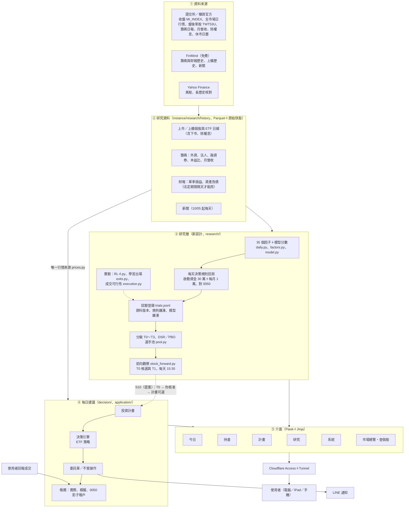
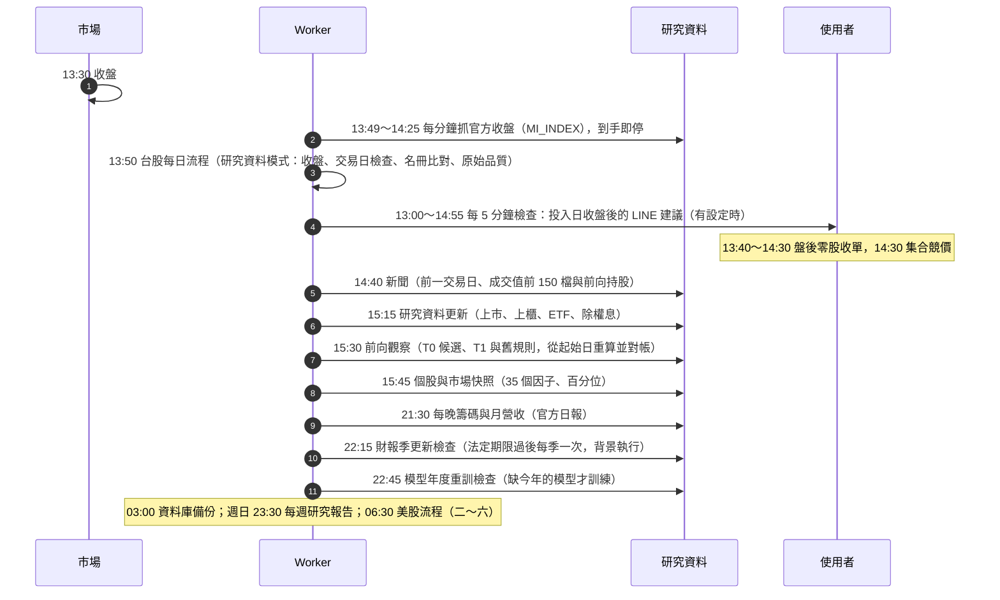
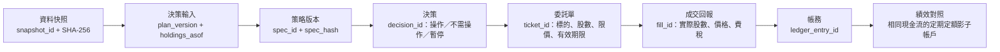
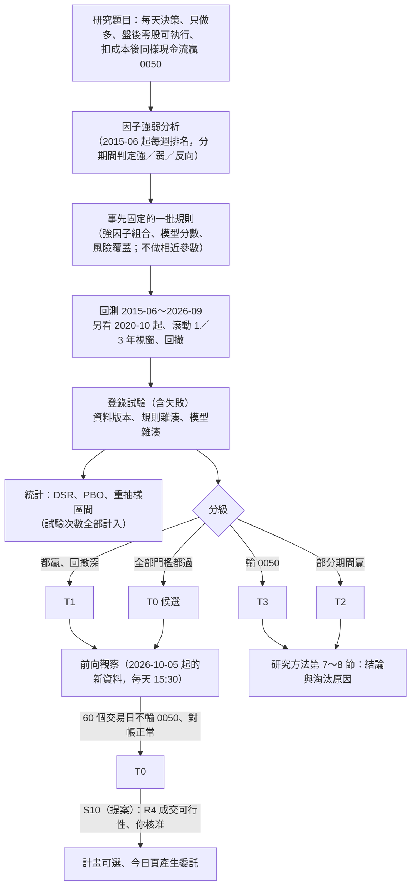
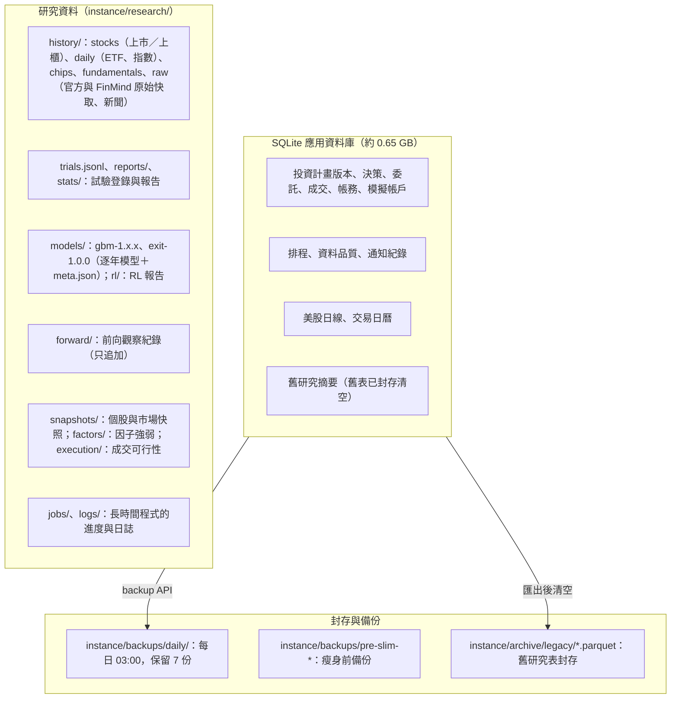
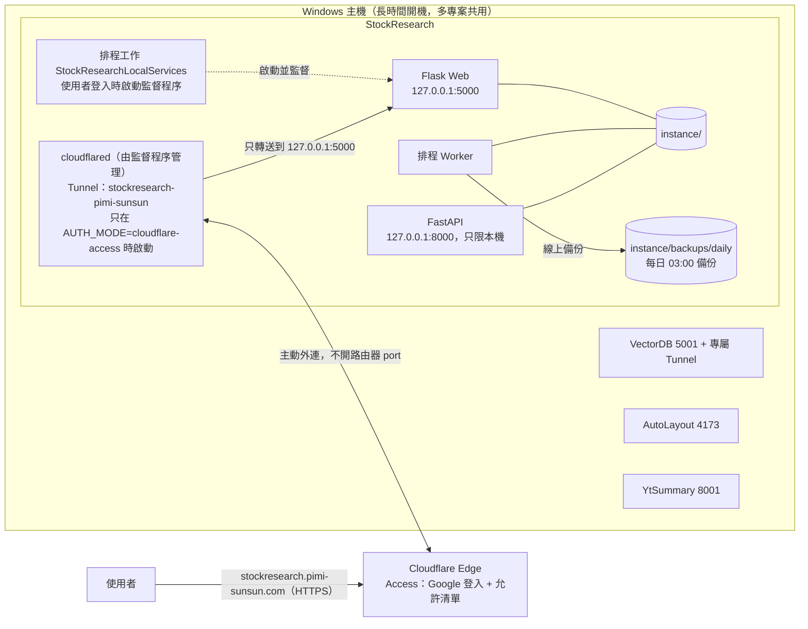
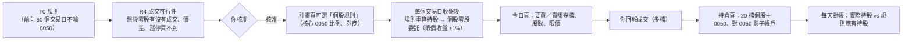

# 交易研究分析平台 — 系統架構

更新：2026-10-07（S9 整合後的現況、研究新設計、S10 目標）。本檔描述現況與目標架構、每日流程與部署拓撲；各元件的交付狀態以 [開發路線圖](development_roadmap.md) 為準，需求以根目錄 [`REQUIREMENTS.md`](../REQUIREMENTS.md) 為準，研究方法與結論在 [`research_method.md`](research_method.md)。

## 產品目標

單人使用的台股交易研究分析平台，兩條主線：

1. **每日建議**（已上線）：使用者建立投資計畫（每月投入、薪資日、策略、券商），每個交易日收盤後由決策引擎產生委託單或「不需操作」，使用者自己在券商下單、回報成交；持續和「相同現金流全部買 0050」比較。目前計畫能選的是 ETF 策略（內建基準＋舊晉級流程核准的）。
2. **研究**（進行中）：在 2015-06 起的資料上找能贏 0050 的每天決策個股規則（新設計），分級 T0～T3，T0 候選與 T1 自動前向觀察；AI 只當研究員（提出與測試規則），不當交易員。

兩條主線目前**還沒接起來**：研究做出的個股規則要等 R4 執行可行性與前向觀察（T0）後，經 S10「個股規則接進每日建議」才能出現在計畫與今日頁（見圖 7）。真實下單永久關閉。

## 架構決策

| 編號 | 決策 | 理由 |
|---|---|---|
| D1 | 單人使用；登入交給 Cloudflare Access（Google），網站驗證 Access JWT | 不必維護自建 OAuth、使用者隔離與 CSRF；沿用 VectorDB 已驗證的做法 |
| D2 | 前端使用 Flask + Jinja + HTML，只加少量原生 JS（複製委託、倒數） | 使用者指定；單人工具不需要前端框架 |
| D3 | 行情與應用資料留在 SQLite；模型預測、特徵快照、試驗逐日結果改存 Parquet 檔，資料庫只存摘要與檔案位置（台股行情 2026-10-06 起改為 D17） | 2026-09-30 量測：22.3 GiB 主檔中行情只佔 0.13 GiB，預測與特徵（含索引）約佔 18.8 GiB |
| D4 | AI 擔任研究員，不擔任交易員；決策引擎只執行已晉級的規則設定檔 | LLM 訓練資料含歷史行情與新聞，讓 LLM 直接判斷買賣無法誠實回測；規則可機械重現 |
| D5 | 回測、前向模擬與每日建議共用同一套盤後成交模型 | 避免回測與實際執行假設不同 |
| D6 | 真實下單永久關閉；系統產生委託單內容，由使用者在券商自行下單並回報成交 | 安全邊界；也不需保存券商憑證 |
| D7 | 主要評估指標是「相同現金流下相對定期定額」，勝率只作參考 | 勝率高但偶爾大虧的策略會輸給定期定額 |
| D8 | 發布使用本專案專屬 Cloudflare Tunnel，公開網址 `https://stockresearch.pimi-sunsun.com`，origin 只綁 `127.0.0.1:5000` | 與 VectorDB、AutoLayout、YtSummary 同一台主機，各專案 Tunnel 與程序互不影響 |
| D9 | 交易日以證交所官方開休市日期判斷，資料隨程式發布並每日更新快取；臨時休市人工補登 | 休市日不誤報缺資料；證交所 API 不可用時仍有離線資料 |
| D10 | 介面一套 HTML、三種版面：電腦完整側邊欄、iPad 圖示側欄、手機底部分頁；深色預設、可切換淺色（cookie，由伺服器直接輸出 `data-theme`，不閃爍） | 使用者會用電腦、iPad、手機開啟（2026-09-30）；不另做 App |
| D11 | 資料庫每天 03:00 以 SQLite backup API 單一步驟線上備份，轉獨立檔後 `quick_check`、記錄各表筆數，保留 7 份；還原演練在暫存路徑核對筆數 | 9.6 GiB 複製約 20 秒，不需停機；WAL 模式下讀取快照不擋寫入 |
| D12 | 研究資料集（長歷史日線、公司行動、總報酬）與研究報告放在 `instance/research/`，以 Parquet／JSON 保存並附 SHA-256；回測引擎只讀這些檔案，不讀寫 SQLite，也不經過 worker。資料集的初次建立用命令列在背景執行；之後由 worker 每個交易日 15:15 只補抓當月與今年（`research_history_refresh`，初次建立前自動略過） | 研究可重現（資料指紋＋設定檔雜湊＋引擎版本 → 報告雜湊），且研究工作不會拖慢或干擾每日流程 |
| D13 | 試驗的資料指紋只涵蓋期間結束日以前的資料（`MarketData.fingerprint_until`，逐日串接雜湊），研究 CLI 一次載入全部目錄序列；排行與 PBO 只用目前資料版本的試驗，舊版保留並計入試驗次數 | 每日新增行情不會把同一設定變成「新試驗」灌水試驗次數；歷史資料被修正時舊結果自動退出排行，但多重檢定仍保守計數 |
| D14 | 成本以券商設定檔表示（`research/costs.py` 的 `BROKERS`：保守、國泰、台新），研究預設保守；計畫選定的券商用於今日建議、預設手續費與影子帳戶 | 研究不因樂觀費率高估多次交易的策略；實際操作的估算貼近使用者的券商 |
| D15 | 通知走 LINE Messaging API push（使用者自己的官方帳號），以 `notification_deliveries` 記錄並以鍵去重；請求帶 `X-Line-Retry-Key` | LINE Notify 已停止；單人使用不需 webhook；重試不會重複送達，排程可每 5 分鐘重跑 |
| D16 | AI 研究員是夜間的提案者：模型輸出經 StrategySpec 驗證的設定檔，由現有引擎在開發期回測並登錄；模型看不到驗證期與最終驗證期，也不接觸下單與每日建議（2026-10-04 起暫停，S9-W07） | 研究可重現、每個提案都計入多重檢定；模型的錯誤只會產生被拒絕或失敗的試驗，不會影響資金 |
| D17 | 單一行情來源（2026-10-06，S9-W03）：台股日線只存研究資料的 Parquet（證交所、櫃買全市場日行情，含下市；當天收盤由官方 MI_INDEX 補上）；今日、持倉、計畫、模擬帳戶與研究都讀它（`research/prices.py`）；SQLite 不再寫台股日線 | 一種資料只存一處；研究與每日建議看到同一個收盤價 |
| D18 | 研究新設計（2026-10-04，S9-W02）：2015-06 起挑規則、2020-10 起另外檢查、每個交易日都能決策、帳戶是啟動資金 30 萬＋每月 1 萬；分級 T0～T3；T0 候選與 T1 自動前向觀察，T0 要前向 60 個交易日不輸 0050 | 2005 年的市場制度（漲跌幅 7%、沒有盤中零股）和現在不同；只在月初決策不符合實際 |
| D19 | 長時間研究程式脫離 worker 與助理工作階段（2026-10-06）：`scripts\start-research.ps1` 以 WMI 建立程序，登錄在 `instance/research/jobs/`（網站「執行中的程式」）；助理啟動後就結束這一輪，不輪詢 | 2026-10-06 曾被桌面版更新與部署打斷；研究不佔 worker、部署不會中斷它 |
| D20 | 機器學習與強化學習只在研究層（2026-10-06）：逐年滾動訓練（只用該年以前的樣本）、模型版本記住訓練時的特徵、試驗輸入含模型檔雜湊；模型分數當成因子給規則用 | 可重現、不偷看未來；模型更新會成為新的試驗，不會悄悄改變舊結果 |
| D21 | 個股規則進每日建議要經過 S10（提案，2026-10-07）：R4 執行可行性 → T0 → 使用者核准 → 計畫可選 → 今日頁產生個股零股委託；在那之前研究規則只出現在研究頁與前向觀察 | 研究結果還沒經過前向驗證與成交可行性檢查，不能直接變成交易建議 |

## 圖 1：現況架構總覽（2026-10-07）

SQLite（`instance/quant_platform.db`，約 0.65 GB）只留應用資料：計畫、決策、委託、帳務、模擬帳戶、排程與資料品質紀錄、美股日線、舊研究摘要。

## 圖 2：每個交易日的時間軸（實際排程，台北時間）

另外：開機與每 15 分鐘的補跑檢查（漏跑的每日流程）、每小時的交易日曆與除權息預告更新。13:30～14:40 與 15:14～15:50 不停服務、不部署（`stop-services.ps1` 擋下）；研究的長時間程式也避開 13:30～14:40。

## 圖 3：決策契約與識別碼鏈

每一步都保存識別碼，任何一筆建議都能回查它用了哪份資料、哪個計畫版本、哪個策略版本。

規則：同一組輸入重跑得到相同決策；建議金額不超過可用現金；未成交不計入持倉；過期委託單不可沿用；資料閘門未通過時輸出「暫停產生新建議」並說明原因，不把既有持倉解讀為必須賣出。

## 圖 4：研究流程（新設計，2026-10-04 起）

防護：挑規則的期間固定（2015-06～2026-09），之後的資料只拿來前向觀察；每個試驗（含失敗）都計入多重檢定；規則只在研究頁出現，不會自動變成交易建議。AI 研究員（舊流程，夜間提案）暫停中（S9-W07）；舊設計的晉級流程（開發 → 驗證 → 最終驗證 → 前向 → 核准）只適用 ETF 規則，紀錄在研究頁「舊設計紀錄」。

## 圖 5：資料儲存分層

## 圖 6：部署拓撲

網站在每個請求驗證 `Cf-Access-Jwt-Assertion`（RS256 簽章、audience、issuer、到期、email），只允許 `ACCESS_ALLOWED_EMAILS`；直接連到 127.0.0.1／localhost 的 loopback 請求可免登入。經 Tunnel 進來的請求雖然來自 127.0.0.1，但 Host 是公開網址，因此一定要有 JWT。設定不完整時所有公開請求回 503。Tunnel `stockresearch-pimi-sunsun`（id `e37bb649-…`）憑證在 `.runtime/cloudflared/`，由 `scripts/run_local_services.ps1` 監督；停止腳本只以本專案憑證路徑辨識 cloudflared 程序。

## 圖 7：目標——研究規則接進每日建議（S10，提案）

需要的新東西：計畫的策略型別「每天決策個股規則」、決策引擎每天跑規則（和前向觀察同一套程式）、一天多檔的委託單與成交回報、持倉頁的多檔顯示與對帳、R4 的實測成交假設放進引擎。範圍與需求變更要使用者同意後才做（路線圖 S10）。

## 模組現況與處置（2026-10-07）

| 模組 | 現況 | 處置 | 階段 |
|---|---|---|---|
| 官方來源與研究資料（`research/history/`、`research/prices.py`） | 唯一行情來源；上市、上櫃、ETF、籌碼、月營收、財報、新聞每天或每季自動更新 | 沿用 | S9 完成 |
| 交易日曆、資料品質（`market_calendar/`、`research/quality.py`） | 可用；今日頁與系統頁讀研究資料的品質 | 沿用 | — |
| 排程、通知、啟停與部署腳本 | 可用；停服務會避開交易時段、研究資料更新與 worker 工作，並以程序建立時間辨識工作 | 沿用 | S1、S9 |
| 研究新設計（`research/daily.py`、`factors.py`、`model.py`、`pool.py`、`stock_forward.py`） | 可用；35 個因子、3 個模型版本、T0～T3、前向觀察 | 主力；研究包見研究方法第 9 節 | S9、R 系列 |
| 強化學習與學習出場（`research/rl.py`、`research/exits.py`） | 實驗完成，未通過（研究方法第 7 節） | 保留程式與報告備查，不再開發 | R15 C 段結束 |
| 成交可行性（`research/execution.py`） | R4 進行中 | 結果決定是否改引擎的成交假設 | R4、S10 前提 |
| 決策引擎、投資計畫、帳務（`decision/`、`application/`） | 可用；只支援 ETF 策略 | 擴充個股規則（S10 提案） | S5、S10 |
| 舊研究（ETF 策略工廠、舊晉級流程、AI 研究員、舊版模型、舊回測與特徵） | 暫停或只讀；舊表已封存清空；研究頁「舊設計紀錄」、系統頁「舊版頁面」備查 | S8 決定刪除 | S8 |
| Dashboard | 新介面五頁＋市場總覽＋個股頁；研究頁以新設計為主；舊頁面收在系統頁 | 舊頁面 S8 移除 | S2、S6、S9 |

## 程式結構

新程式放在既有 `src/quant_platform/` 內，名稱在各工作包定案：

| 位置 | 內容 |
|---|---|
| `market_calendar/` | 官方交易日曆與臨時休市（已建立；CLI：`python -m quant_platform.market_calendar`） |
| `research/` | 研究地基（S3，已建立）：`history/`（官方長歷史抓取、快取、Parquet 資料集、除權息依表頭解析與參考價檢查、總報酬、Yahoo 交叉核對、盤後零股成交分布與各限價成交率、目錄宣告的分割、00631L 上市前的合成回填 `synthesize_backfill`；CLI `python -m quant_platform.research.history`）、`costs.py`（手續費、證交稅、盤後零股成交價、今日委託限價 `order_limit`、券商設定檔）、`cashflow.py`（投入計畫）、`spec.py`（策略設定檔 v1 與四個基準）、`market.py`（資料載入與期間資料指紋）、`engine.py`（現金流回測）、`compare.py`（對定期定額的滾動視窗比較）、`registry.py`（試驗登錄與資料版本）、`periods.py`（期間與最終驗證期關卡）、`statistics.py`、`significance.py`（DSR、PBO、bootstrap）、`batches.py`、`summary.py`、`forward.py`（前向模擬）、`metrics.py`、`reports.py`；CLI `python -m quant_platform.research baselines|trial|batch|trials|stats|schema|legacy`（`--broker`、`--cost-scale`、`--execution-lag`）。後續：AI 研究員（S4-W04） |
| `application/notifications.py` | LINE Messaging API push、去重與傳送紀錄、訊息內容（S5-W07；設定 `docs/line-notifications.md`） |
| `research/history/stocks.py` | 證交所每日全市場行情（含後來下市的公司）一天一檔快取，每年一個 Parquet（`history/stocks/twse/`）；CLI `python -m quant_platform.research.history stocks`；worker 15:15 研究資料更新後 `append_current_year` 補當年缺的日子（R2），上櫃也補（櫃買官方行情，查詢要帶 `type=EW`）。上櫃歷史（R6）：`history tpex` 把 FinMind `TaiwanStockPrice`（2000 起、含下市）整理成 `history/stocks/tpex/`；轉上市的股票只留轉上市前的日子 |
| `research/daily.py` | 新設計（S9-W02）：每天決策的規則（`DailyRule`）、因子矩陣（35 個：價格、成交、技術指標、籌碼、月營收、財報；另有模型分數 `ml_gbm*`）、排名與保留、帳戶模擬（啟動資金＋每月、核心 0050、每筆最低金額）、2015-06 起與 2020-10 起、滾動 1／3 年視窗、門檻、登錄（期間 `recent`）；`python -m quant_platform.research daily --name factors|risk|chips|combos|tpex|overlays|holdings|model|model-excess|statements|turnover|exits`。持股與換手（2026-10-06～07）：依波動度配置（`weighting`）、帳戶跌破 200 日均線換 0050（`account_filter`）、分數取近 N 日平均（`smooth`）、每週決策（`check`）、學習出場（`exit_model`），預設值都不進規則雜湊。股票池 `universe`（上市／上市＋上櫃，R6）；風險控制（R7）：產業上限、移動停損（`stop_loss`，停損後 20 個交易日不買回）、加權指數 200 日均線濾網（`market_filter`）。資料版本 `fingerprint`：期間內的上市（＋上櫃）行情、0050、除權息事件、該股票池代號的籌碼資料（只算到期間結束，夜間更新不會改變它） |
| `scripts/slim-legacy-tables.ps1`、`scripts/slim_legacy_tables.py` | 資料庫瘦身（S9-W06）：停服務、複製備份到 `instance/backups/pre-slim-<時間>/`、筆數與封存一致才清空 12 張舊研究結果表、VACUUM、一定重新啟動服務；紀錄在 `instance/research/logs/slim-<時間>.log`。回復：停服務後把備份資料夾的檔案複製回 `instance/` |
| `scripts/archive_legacy_tables.py` | 舊研究資料表只讀封存到 `instance/archive/legacy/*.parquet`，`manifest.json` 記錄筆數與雜湊（S9-W06） |
| `research/news.py` | 新聞收集（R15/R16）：worker `news_collection` 交易日 14:40 收前一個交易日、成交值前 150 檔與前向觀察持股的新聞（FinMind，一檔一天一次），存 `history/raw/finmind/TaiwanStockNews/<日期>/<代號>.json.gz`；只收集、還不用來決策 |
| `research/prices.py` | 單一行情來源（S9-W03）：`ResearchPrices`（ETF 日線、全市場上市股與上櫃股（`.TWO`）、當天 MI_INDEX 收盤）提供 `list_bars`／`latest_closes`／`latest_market_date`；`FallbackPrices` 研究資料優先、舊 SQLite 日線備援；`fetch_today_close` 由 worker `official_close_fetch`（交易日 13:49～14:25 每分鐘，到手即停）呼叫。`Bar` 另有 `open`、`volume`（研究資料的開盤與成交股數，當天的從 MI_INDEX），模擬帳戶 `PaperTradingService` 改用 `prices` 成交與估值（S9-W05）。`DailyMarketDataPipeline` 在舊版研究暫停時，台股改用 `research_prices`／`research_close`（`fetch_today_close`）：抓官方收盤進研究資料、檢查應有交易日、記錄 `daily_market_data`，`latest_market_date`／`is_fresh` 讀研究資料（S9-W03 完成，2026-10-06） |
| `research/snapshot.py` | 個股頁（S9-W05）：`build` 載入近 3 年上市＋上櫃行情與籌碼，算最新完整交易日（有行情的檔數達近 20 天最多的八成）每檔 30 個因子的數值與全市場百分位，存 `research/snapshots/stocks-latest.json`（約 3 MB、20 秒）；worker `stock_snapshot` 交易日 15:45、CLI `python -m quant_platform.research snapshot`；`load`（依檔案時間快取）、`search`、`stock_bars`（兩個市場的日線）、`view`、`candles`（K 線 SVG 幾何）。網頁 `/stock`、`/stock/<代號>`（`v2/stock.html`）。2026-10-06 加上市場段落（近 250 個交易日的加權指數與 200 日均線、站上 200 日均線比例、漲跌家數、52 週新高新低）與 `market_view`（網頁 `/market`，`v2/market.html`；舊版移到 `/market/legacy`） |
| `research/model.py` | 機器學習基準（R15 B 段）：`MODELS`（因子 → 版本與標籤：`ml_gbm` gbm-1.0.0 排名、`ml_gbm_excess` gbm-1.1.0 超額報酬、`ml_gbm_statements` gbm-1.2.0 含財報 35 個特徵）、`train`（每年一個梯度提升模型，只用標籤在該年以前結束的樣本；meta 保留其他年份）、`train_year`（年度重訓，worker `model_retrain` 交易日 22:45 檢查）、`scores`（每個交易日用該年的模型）、`digest`；模型檔在 `research/models/<版本>/` |
| `research/exits.py` | 學習個股出場（R15 C1b，`exit-1.0.0`）：每檔持股每天預測「留著比換成規則的下一名」之後 20 個交易日多賺多少，少於一趟成本就賣、20 個交易日不買回；逐年滾動的梯度提升；`DailyRule.exit_model="q1"`；CLI `research exits`。未通過（研究方法第 7 節） |
| `research/blend.py` | 組合帳戶（2026-10-09）：`BlendRule`（2～4 個每天決策規則各佔一份錢，其餘買 0050；各份不再平衡）、`BlendAccount`（各份照比例分到啟動資金與每月投入，逐日加總價值、交易與持股）、`evaluate_blend`／`run_blend_trial`（和單一規則同一套 `daily.account_report` 門檻、滾動視窗與登錄）、`parse_spec`；前向觀察 `kind: blend`；批次 `daily --name blends`、流程 `blends` |
| `research/rl_sleeves.py` | 強化學習 C3（2026-10-09，`rl-sleeves-1.0.0`）：每天在機器學習每週、站上 200 日均線（依波動度）、0050 三個家族之間從 8 種固定比例挑一種；移動成本 0.5%、獎勵另扣 2%；PPO、逐年滾動、5 個種子；對照每個家族、固定比例與「訓練期最好的固定組合」；CLI `research rl-sleeves`、流程 `rl-sleeves`，報告 `research/rl/rl-sleeves-1.0.0/` |
| `research/execution.py` | 成交可行性（R4）：把 T0 候選與 T1 規則的每筆個股委託，和快取的盤後零股競價（TWT53U，每 10 個交易日一天）比：有沒有成交、限價收盤 ±1% 內能否成交、漲跌停、成交價離收盤、委託佔競價量；CLI `research execution`，報告 `research/execution/` |
| `research/rl.py` | 強化學習部位調整（R15 C1；版本 `rl-overlay-1.0.0`、`1.1.0`〔換部位在獎勵裡多扣 2%〕，兩版都未通過）：`build_overlay`（用研究引擎重播底層規則的個股帳戶與 0050，成每日報酬與 13 個狀態）、`step`（一個交易日的部位、成本、回撤懲罰）、`train_policy`（PPO，PyTorch）、`run_policy`（5 個種子的貪婪選擇平均）、`walk_forward`（逐年訓練與測試，報告存 `research/rl/<版本>/report.json`）；CLI `research rl`、`start-research.ps1 -Name rl` |
| `research/quality.py` | 研究資料品質（S9-W05）：`check` 檢查上市、上櫃、ETF 與指數、籌碼、新聞、個股快照是否到應有的交易日，最新一天超過漲跌幅且沒有除權息紀錄的股票、消失的檔數；系統頁的「台股行情」「台股資料品質」與「資料品質」卡片讀它（網頁行程內快取 2 分鐘） |
| `research/jobs.py` | 長時間研究程式的登錄（`instance/research/jobs/*.json`）：名稱、進度、預計完成、狀態；研究頁「執行中的程式」與 `/research/jobs.json`；背景執行用 `scripts/research-pipeline.ps1` |
| `research/factors.py` | 因子強弱分析：每月排序相關與前後五分之一報酬，分期間報告與判定；`python -m quant_platform.research factors` |
| `research/history/finmind.py` | FinMind 免費等級的籌碼與基本面（外資持股、月營收、本益比、融資融券、三大法人），每檔一次、可續傳、避開平日 13:30–15:30；`python -m quant_platform.research.history finmind` |
| `research/history/chips_daily.py` | 每晚籌碼（S9-W04）：證交所與櫃買四種全市場日報的網址、快取鍵（`raw/official_chips/<交易所>_<資料>/<年>/<日>.json`）、解析成籌碼檔欄位；`fetch`（經 `OfficialHistoryClient`，當天的複本收盤後再要一次）、`cached_rows`；`research/chips.py` `build` 在 FinMind 的資料後補上日報有、FinMind 沒有的（日期, 代號）；worker `chips_update` 交易日 21:30。月營收：`fetch_revenue`（證交所 t187ap05_L、櫃買 mopsfin_t187ap05_O，存 `raw/official_revenue/<交易所>/<月份>-<出表日期>.json`）、`cached_revenue_rows`（出表日期由早到晚） |
| `research/fundamentals.py` | 財報因子：`build` 把 FinMind 單季損益表與資產負債表整理成 `history/fundamentals/quarterly.parquet`（代號、季、可用日＝法定期限隔天、營收、毛利、營業利益、歸屬母公司淨利、EPS、資產、負債、權益；CLI `history fundamentals`）；`factor_table`（只用連續的季）；`FundamentalStore`（跟著籌碼檔的資料夾，`FactorPanel` 需要時才建）；`digest`；`due_quarter`（法定期限已過的最新一季）。季更新：worker `statements_refresh` 每晚 22:15 檢查，每季一次以 `start-research.ps1 -Name statements-refresh` 在背景重抓（`history finmind --refresh-quarter due`，只抓近期有成交、還沒有該季的檔）再 `history fundamentals`；標記檔 `history/fundamentals/refresh-<季>.started` |
| `dashboard/templates/v2/_research_tabs.html` | 研究頁分頁（2026-10-07）：總覽（新設計的分級、目前最好的規則、目前結論〔讀 `docs/research_method.md`「目前結論（網站…）」一段〕、最近完成的研究程式）、選手池、前向觀察、因子強弱、機器學習與 RL、執行中的程式、舊設計紀錄（舊網址 `?tab=rules|promotion|agent` 轉到這裡）；`/research?tab=…`、`/research/pool`、`/research/rules/<雜湊>` 共用 |
| `research/stock_forward.py` | 個股規則前向模擬（R2；2026-10-09 加 `detail`：一個規則的每日資產、目前持股與比重、開始以來每一筆交易與除權息，網頁 `/research/forward/<雜湊>`）：`forward/stocks/tracked.json`（兩段期間都贏的規則自動加入、起始日）、worker 15:30 寫 `forward/stocks/log.jsonl`（持股、交易、除權息調整、0050 對照、重算檢查）、`reconcile` 對帳；CLI `python -m quant_platform.research forward [--date]` |
| `research/stock_rules.py` | 個股因子規則（單一或混合因子、資格門檻、前 N 名等權、每月／每季、緩衝、一次投入）、兩階段大掃描、登錄為候選試驗（資料指紋 `stocks:…`）；CLI `python -m quant_platform.research stocks --period … --name first|second|sweep|high52 [--screen|--top N] [--lump-sum 300000]` |
| `research/pool.py` | 研究選手池：從試驗登錄、晉級帳本、AI 日誌與統計檔組出每個規則的狀態與原因；`/research/pool` 與 `/research/pool.json` |
| `docs/research_method.md` | 研究方法、架構圖、關卡流程圖、結論、淘汰方向、研究路線圖 R1–R12（系統頁專案資訊「研究方法」） |
| `research/legacy_challenger.py` | 舊版機器學習模型的挑戰者評估（S5-W06 依據）：唯讀載入樣本外預測與 Yahoo 日線、官方除權息表換算持有單位、三種用法對 0050 定期定額與隨機（周轉相同）／最差對照、排序相關、依預測開始前規模縮小股票池的倖存者偏差檢查；CLI `python -m quant_platform.research legacy [--experiment N]`，報告存 `instance/research/legacy/challenger-*.json`，研究頁顯示最新一份 |
| `research/allocation.py` | 投入日的目標配置（固定權重、趨勢控制的防守配置、ETF 輪動與核心＋衛星）與說明文字；研究引擎與今日建議共用；即時行情的分割還原（`adjust_gaps`） |
| `application/host_memory.py` | 主機記憶體與外洩的核心程序物件（`GlobalMemoryStatusEx`、池標籤 `Proc`、程序數）；系統頁狀態與今日頁提示（Windows） |
| `scripts/check-public.ps1` | 不需登入的外網檢查：本專案 cloudflared 的 metrics `/ready` 有連線，且公開網址回 302 到 Cloudflare Access；每輪部署後執行（AGENTS.md） |
| `scripts/close_interrupted_runs.py` | `stop-services.ps1` 停止全部服務後，把仍是「執行中」的紀錄標為中斷；worker 啟動時另關閉重開機前開始的紀錄 |
| `application/dividends.py` | 股利（S5-W03）：證交所 TWT48U 與櫃買 `tpex_exright_prepost` 除權除息預告（worker `ex_dividend_refresh` 每小時檢查、每 12 小時更新），快取 `instance/events/ex_dividends.json`；持倉頁即將除息與待記錄的股利 |
| `research/weekly.py` | 每週研究報告（S6-W04）：研究頁本週即時版本；worker 週日 23:30 存 `instance/research/weekly/<年>-W<週>.json` |
| `research/promotion.py` | 晉級流程（S4-W06）：開發期／驗證期／最終驗證期關卡、成本加倍與晚一天執行、前向模擬 40 個交易日、使用者核准與撤銷；只追加的雜湊串鏈紀錄 `instance/research/promotions.jsonl`；`strategy_catalog()` 提供計畫頁可選的策略（內建基準＋已核准） |
| `research/agent/` | AI 研究員（S4-W04）：`llm.py`（OpenAI Responses API、`store: false`、費用帳本與每月預算硬上限）、`researcher.py`（提示、設定檔驗證與去重、開發期試驗、研究日誌、每晚上限與鎖）；CLI `python -m quant_platform.research agent [--dry-run|--check]`；worker 工作 `research_agent`（每晚 22:00） |
| `decision/` | 投資計畫、決策引擎、委託單、帳務與影子帳戶 |
| `dashboard/v2.py`、`dashboard/templates/v2/`、`static/css/v2.css` | 新介面：今日、持倉、計畫、研究、系統（主導覽五項；下方「市場總覽」`/market` 與查個股 `/stock`，手機在頂端列）（含專案資訊，直接讀 docs 原始檔）；電腦／iPad／手機三種版面、深色預設（S2-W03 第二版）；使用教學 `/help`（讀 `docs/user-guide.md`，S6-W06） |
| `application/database_backup.py`、`scripts/database_backup.py` | 每日線上備份、保留 7 份、狀態與還原演練（S2-W05） |
| `application/close_availability.py` | 收盤資料各來源公布時間量測（S1-W05，`instance/close_availability.jsonl`） |
| `dashboard/cloudflare_access.py` | Cloudflare Access JWT 驗證、擁有者允許清單、本機 loopback 例外、安全標頭（S2-W01） |
| `application/prediction_archive.py` | 預測保留政策與 Parquet 封存（S1-W03） |
| `application/listing_reconciliation.py` | 官方名冊比對與下市處理（S1-W02） |

## 2026-10-02 — Home 統一登入整合

身份驗證 adapter 見 [Home 整合](home_sso.md)。Home 只管理身份、系統授權、服務憑證與使用稽核；業務 DB、Qdrant／模型與 AI 呼叫留在原系統。
