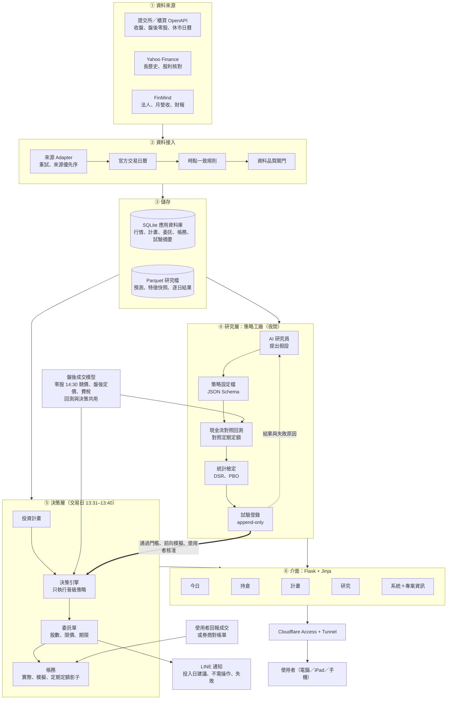
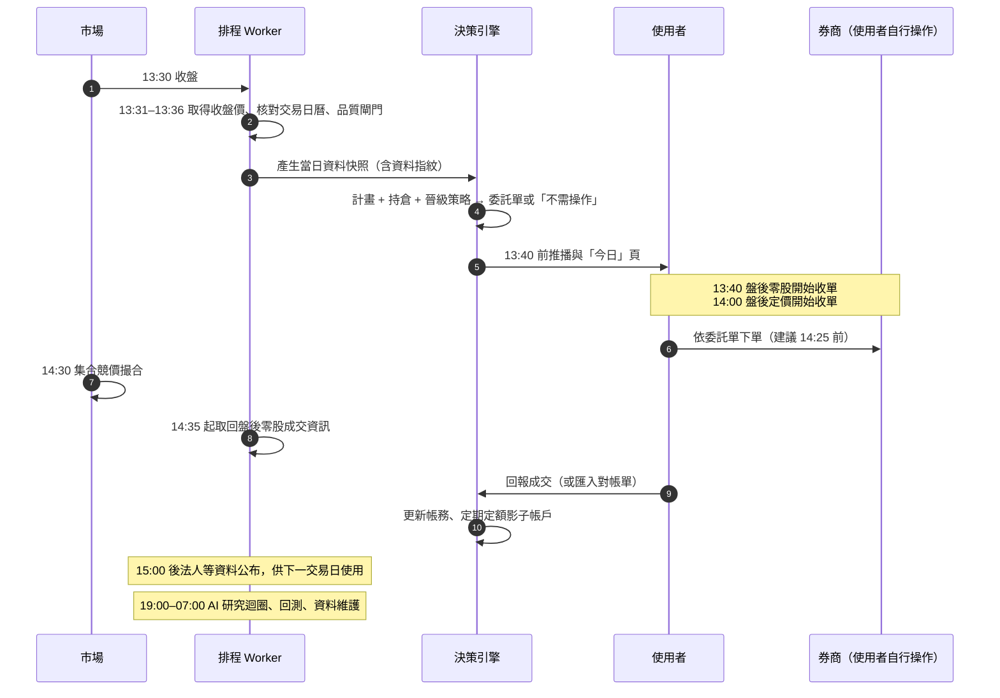
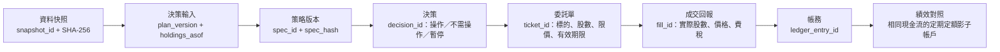
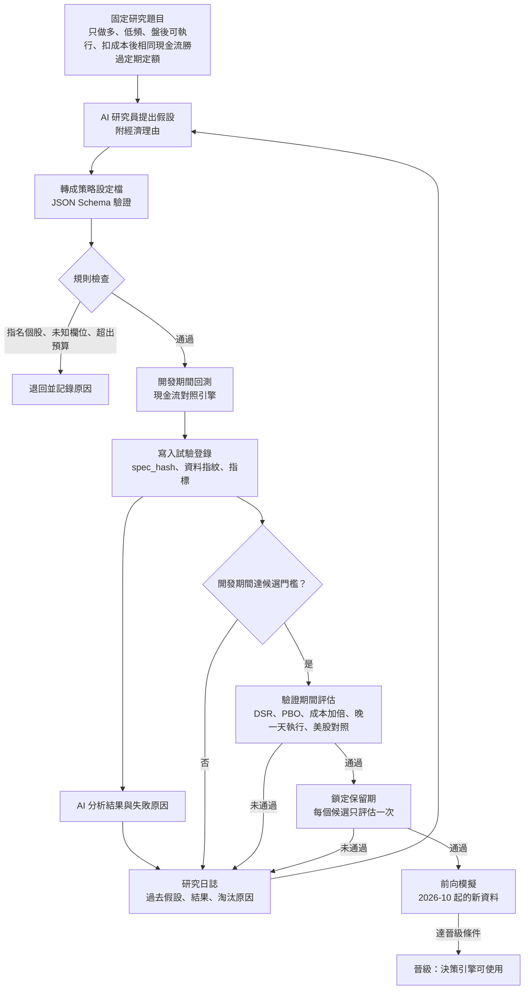
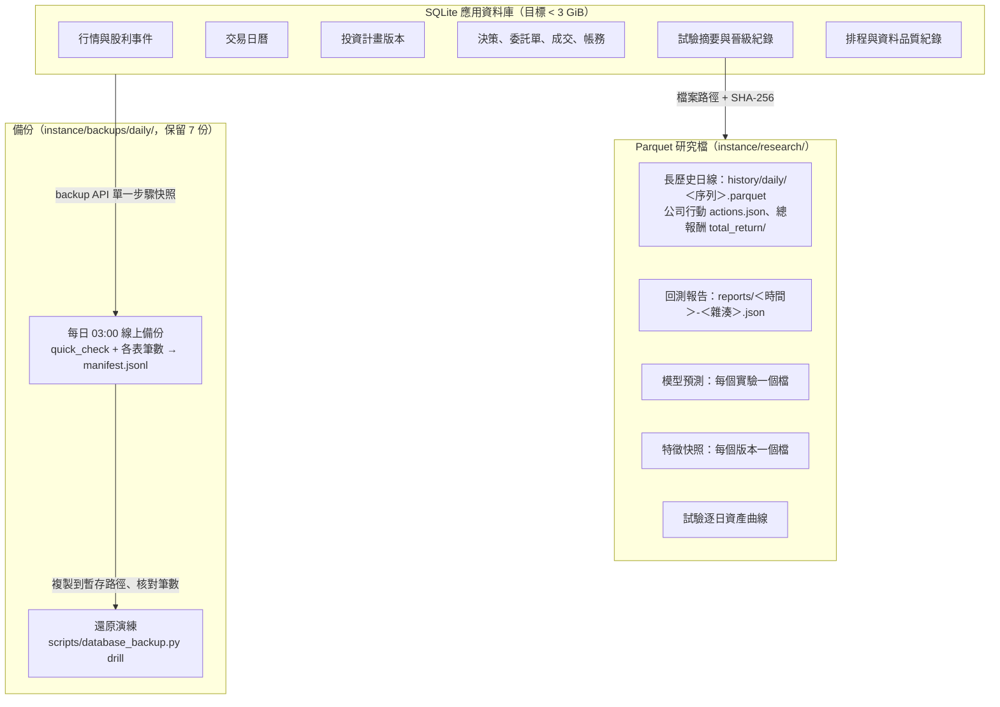
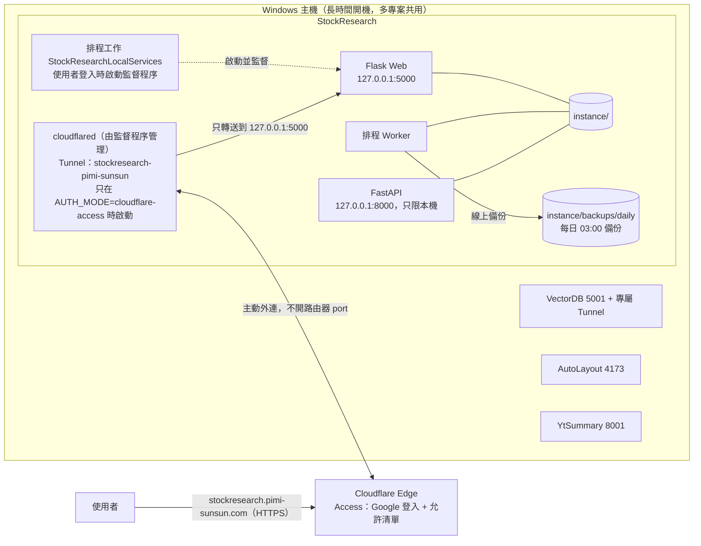

# 盤後決策台 — 系統架構

更新：2026-10-01。本檔描述目標架構、每日流程與部署拓撲；各元件的交付狀態以 [開發路線圖](development_roadmap.md) 為準，需求以根目錄 [`REQUIREMENTS.md`](../REQUIREMENTS.md) 為準。

## 產品目標

單人使用的台股盤後決策台。每個交易日 13:40 前告訴使用者「今天要不要操作、操作什麼、限價多少、為什麼」；14:30 撮合後記錄結果；持續和「相同現金流的定期定額」比較。策略由 AI 研究員在歷史資料上提出與淘汰，只有通過統計門檻與前向模擬的規則才進入每日決策。

## 架構決策

| 編號 | 決策 | 理由 |
|---|---|---|
| D1 | 單人使用；登入交給 Cloudflare Access（Google），網站驗證 Access JWT | 不必維護自建 OAuth、使用者隔離與 CSRF；沿用 VectorDB 已驗證的做法 |
| D2 | 前端使用 Flask + Jinja + HTML，只加少量原生 JS（複製委託、倒數） | 使用者指定；單人工具不需要前端框架 |
| D3 | 行情與應用資料留在 SQLite；模型預測、特徵快照、試驗逐日結果改存 Parquet 檔，資料庫只存摘要與檔案位置 | 2026-09-30 量測：22.3 GiB 主檔中行情只佔 0.13 GiB，預測與特徵（含索引）約佔 18.8 GiB |
| D4 | AI 擔任研究員，不擔任交易員；決策引擎只執行已晉級的規則設定檔 | LLM 訓練資料含歷史行情與新聞，讓 LLM 直接判斷買賣無法誠實回測；規則可機械重現 |
| D5 | 回測、前向模擬與每日建議共用同一套盤後成交模型 | 避免回測與實際執行假設不同 |
| D6 | 真實下單永久關閉；系統產生委託單內容，由使用者在券商自行下單並回報成交 | 安全邊界；也不需保存券商憑證 |
| D7 | 主要評估指標是「相同現金流下相對定期定額」，勝率只作參考 | 勝率高但偶爾大虧的策略會輸給定期定額 |
| D8 | 發布使用本專案專屬 Cloudflare Tunnel，公開網址 `https://stockresearch.pimi-sunsun.com`，origin 只綁 `127.0.0.1:5000` | 與 VectorDB、AutoLayout、YtSummary 同一台主機，各專案 Tunnel 與程序互不影響 |
| D9 | 交易日以證交所官方開休市日期判斷，資料隨程式發布並每日更新快取；臨時休市人工補登 | 休市日不誤報缺資料；證交所 API 不可用時仍有離線資料 |
| D10 | 介面一套 HTML、三種版面：電腦完整側邊欄、iPad 圖示側欄、手機底部分頁；深色預設、可切換淺色（cookie，由伺服器直接輸出 `data-theme`，不閃爍） | 使用者會用電腦、iPad、手機開啟（2026-09-30）；不另做 App |
| D11 | 資料庫每天 03:00 以 SQLite backup API 單一步驟線上備份，轉獨立檔後 `quick_check`、記錄各表筆數，保留 7 份；還原演練在暫存路徑核對筆數 | 9.6 GiB 複製約 20 秒，不需停機；WAL 模式下讀取快照不擋寫入 |
| D12 | 研究資料集（長歷史日線、公司行動、總報酬）與研究報告放在 `instance/research/`，以 Parquet／JSON 保存並附 SHA-256；回測引擎只讀這些檔案，不讀寫 SQLite，也不經過 worker。資料集的初次建立用命令列在背景執行；之後由 worker 每個交易日 15:15 只補抓當月與今年（`research_history_refresh`，初次建立前自動略過） | 研究可重現（資料指紋＋設定檔雜湊＋引擎版本 → 報告雜湊），且研究工作不會拖慢或干擾每日流程 |
| D13 | 試驗的資料指紋只涵蓋期間結束日以前的資料（`MarketData.fingerprint_until`，逐日串接雜湊），研究 CLI 一次載入全部目錄序列；排行與 PBO 只用目前資料版本的試驗，舊版保留並計入試驗次數 | 每日新增行情不會把同一設定變成「新試驗」灌水試驗次數；歷史資料被修正時舊結果自動退出排行，但多重檢定仍保守計數 |
| D14 | 成本以券商設定檔表示（`research/costs.py` 的 `BROKERS`：保守、國泰、台新），研究預設保守；計畫選定的券商用於今日建議、預設手續費與影子帳戶 | 研究不因樂觀費率高估多次交易的策略；實際操作的估算貼近使用者的券商 |
| D15 | 通知走 LINE Messaging API push（使用者自己的官方帳號），以 `notification_deliveries` 記錄並以鍵去重；請求帶 `X-Line-Retry-Key` | LINE Notify 已停止；單人使用不需 webhook；重試不會重複送達，排程可每 5 分鐘重跑 |
| D16 | AI 研究員是夜間的提案者：模型輸出經 StrategySpec 驗證的設定檔，由現有引擎在開發期回測並登錄；模型看不到驗證期與保留期，也不接觸下單與每日建議 | 研究可重現、每個提案都計入多重檢定；模型的錯誤只會產生被拒絕或失敗的試驗，不會影響資金 |

## 圖 1：目標架構總覽

## 圖 2：每個交易日的盤後時間軸

目標：13:40 前完成建議；研究與重運算放在晚間，不與決策時段搶資源。

時間點依據：盤後零股 13:40–14:30 收單、14:30 一次集合競價；盤後定價交易 14:00–14:30 收單、以當日收盤價成交。各資料來源的實際可取得時間在 S1-W05 實測後回填本圖。

## 圖 3：決策契約與識別碼鏈

每一步都保存識別碼，任何一筆建議都能回查它用了哪份資料、哪個計畫版本、哪個策略版本。

規則：同一組輸入重跑得到相同決策；建議金額不超過可用現金；未成交不計入持倉；過期委託單不可沿用；資料閘門未通過時輸出「暫停產生新建議」並說明原因，不把既有持倉解讀為必須賣出。

## 圖 4：AI 研究迴圈（策略工廠）

防護：AI 只輸出設定檔，不執行程式；看不到保留期資料；所有試驗（含失敗）都計入多重檢定；研究只在夜間執行並設每日試驗與 API 預算。保留期已在 2026-08 前的研究中被使用過的部分，於路線圖 S4-W02 記錄為已知限制；完全乾淨的驗證是前向模擬。

## 圖 5：資料儲存分層

## 圖 6：部署拓撲

網站在每個請求驗證 `Cf-Access-Jwt-Assertion`（RS256 簽章、audience、issuer、到期、email），只允許 `ACCESS_ALLOWED_EMAILS`；直接連到 127.0.0.1／localhost 的 loopback 請求可免登入。經 Tunnel 進來的請求雖然來自 127.0.0.1，但 Host 是公開網址，因此一定要有 JWT。設定不完整時所有公開請求回 503。Tunnel `stockresearch-pimi-sunsun`（id `e37bb649-…`）憑證在 `.runtime/cloudflared/`，由 `scripts/run_local_services.ps1` 監督；停止腳本只以本專案憑證路徑辨識 cloudflared 程序。

## 模組現況與處置

| 模組 | 現況 | 處置 | 階段 |
|---|---|---|---|
| 來源 Adapter（證交所、櫃買、Yahoo、FinMind、MOPS） | 可用 | 沿用；補官方交易日曆、2003 年起長歷史、股利事件、盤後零股成交資訊 | S1、S3 |
| 時點一致觀測與修訂 | 可用 | 沿用 | — |
| 交易日曆 `market_calendar/` | 完成（S1-W01）：證交所 2021–2026、每日更新快取、人工補登臨時休市 | 沿用；2020 年以前由 S3-W01 以實際成交資料推算 | S1、S3 |
| 資料品質閘門 | 可用；交易日判斷已改用官方日曆 | 保留阻擋邏輯；S1-W02 處理停牌與下市規則 | S1 |
| 排程與通知 | 可用；補抓守門員重跑問題已修正，啟停腳本與單一監督程序完成（S1-W04）；需求 §13 的模組以 `PAUSED_MODULES` 暫停（S1-W06）；LINE 通知（`application/notifications.py`，worker 工作 `line_plan_advice`，S5-W07） | 依 S1-W05 量測重新分配時段（決策 13:30–13:40、研究夜間） | S1、S5 |
| 特徵與標籤資料庫 | 可用；佔 8.6 GiB | 只保留使用中版本，其餘轉 Parquet | S1 |
| 模型研究（Model Zoo、AutoML） | 可用；預測佔 10.2 GiB | 預測改存 Parquet；ML 只作為挑戰者 | S1、S4 |
| 走動式回測、因子、Regime | 可用 | 保留作參考；主要評估改用現金流對照引擎 | S3 |
| 九種組合配置 | 可用 | 凍結；策略設定檔只提供等權、反波動與目標權重 | S8 |
| `after_hours_ai.py`、`decision_support.py` | 可用；單檔 108 KB、固定權重組分 | 拆解改寫為決策引擎 + 策略設定檔 | S5 |
| 模擬交易狀態機 | 可用 | 沿用；擴充為實際帳戶、前向模擬與定期定額影子帳戶 | S5 |
| Google OAuth 登入 | 可用 | 由 Cloudflare Access 取代，程式於 S8 移除 | S2、S8 |
| 強化學習、影子交易、晉級沙盒、模型治理 | 可用 | 凍結並移出導覽；S8 退場 | S8 |
| RAG 知識庫、新聞情緒 | 可用 | 凍結；需要文字解釋時再評估 | S8 |
| 盤中／衍生品、Google Trends、法說會 | 可用 | 停止排程收集，保留程式；S8 決定去留 | S1、S8 |
| Dashboard（38 個模板） | 資訊過載；新介面 5 頁已上線（電腦／iPad／手機、深色預設） | 新介面 5 頁 + 專案資訊；舊頁收進「研究 › 舊版工具」，S8 移除 | S2、S6 |

## 目標程式結構

新程式放在既有 `src/quant_platform/` 內，名稱在各工作包定案：

| 位置 | 內容 |
|---|---|
| `market_calendar/` | 官方交易日曆與臨時休市（已建立；CLI：`python -m quant_platform.market_calendar`） |
| `research/` | 研究地基（S3，已建立）：`history/`（官方長歷史抓取、快取、Parquet 資料集、除權息依表頭解析與參考價檢查、總報酬、Yahoo 交叉核對、盤後零股成交分布與各限價成交率、目錄宣告的分割、00631L 上市前的合成回填 `synthesize_backfill`；CLI `python -m quant_platform.research.history`）、`costs.py`（手續費、證交稅、盤後零股成交價、今日委託限價 `order_limit`、券商設定檔）、`cashflow.py`（投入計畫）、`spec.py`（策略設定檔 v1 與四個基準）、`market.py`（資料載入與期間資料指紋）、`engine.py`（現金流回測）、`compare.py`（對定期定額的滾動視窗比較）、`registry.py`（試驗登錄與資料版本）、`periods.py`（期間與保留期關卡）、`statistics.py`、`significance.py`（DSR、PBO、bootstrap）、`batches.py`、`summary.py`、`forward.py`（前向模擬）、`metrics.py`、`reports.py`；CLI `python -m quant_platform.research baselines|trial|batch|trials|stats|schema|legacy`（`--broker`、`--cost-scale`、`--execution-lag`）。後續：AI 研究員（S4-W04） |
| `application/notifications.py` | LINE Messaging API push、去重與傳送紀錄、訊息內容（S5-W07；設定 `docs/line-notifications.md`） |
| `research/legacy_challenger.py` | 舊版機器學習模型的挑戰者評估（S5-W06 依據）：唯讀載入樣本外預測與 Yahoo 日線、官方除權息表換算持有單位、三種用法對 0050 定期定額與隨機（周轉相同）／最差對照、排序相關、依預測開始前規模縮小股票池的倖存者偏差檢查；CLI `python -m quant_platform.research legacy [--experiment N]`，報告存 `instance/research/legacy/challenger-*.json`，研究頁顯示最新一份 |
| `research/allocation.py` | 投入日的目標配置（固定權重、趨勢控制的防守配置、ETF 輪動與核心＋衛星）與說明文字；研究引擎與今日建議共用；即時行情的分割還原（`adjust_gaps`） |
| `application/host_memory.py` | 主機記憶體與外洩的核心程序物件（`GlobalMemoryStatusEx`、池標籤 `Proc`、程序數）；系統頁狀態與今日頁提示（Windows） |
| `scripts/check-public.ps1` | 不需登入的外網檢查：本專案 cloudflared 的 metrics `/ready` 有連線，且公開網址回 302 到 Cloudflare Access；每輪部署後執行（AGENTS.md） |
| `scripts/close_interrupted_runs.py` | `stop-services.ps1` 停止全部服務後，把仍是「執行中」的紀錄標為中斷；worker 啟動時另關閉重開機前開始的紀錄 |
| `application/dividends.py` | 股利（S5-W03）：證交所 TWT48U 與櫃買 `tpex_exright_prepost` 除權除息預告（worker `ex_dividend_refresh` 每小時檢查、每 12 小時更新），快取 `instance/events/ex_dividends.json`；持倉頁即將除息與待記錄的股利 |
| `research/weekly.py` | 每週研究報告（S6-W04）：研究頁本週即時版本；worker 週日 23:30 存 `instance/research/weekly/<年>-W<週>.json` |
| `research/promotion.py` | 晉級流程（S4-W06）：開發期／驗證期／保留期關卡、成本加倍與晚一天執行、前向模擬 40 個交易日、使用者核准與撤銷；只追加的雜湊串鏈紀錄 `instance/research/promotions.jsonl`；`strategy_catalog()` 提供計畫頁可選的策略（內建基準＋已核准） |
| `research/agent/` | AI 研究員（S4-W04）：`llm.py`（OpenAI Responses API、`store: false`、費用帳本與每月預算硬上限）、`researcher.py`（提示、設定檔驗證與去重、開發期試驗、研究日誌、每晚上限與鎖）；CLI `python -m quant_platform.research agent [--dry-run|--check]`；worker 工作 `research_agent`（每晚 22:00） |
| `decision/` | 投資計畫、決策引擎、委託單、帳務與影子帳戶 |
| `dashboard/v2.py`、`dashboard/templates/v2/`、`static/css/v2.css` | 新介面：今日、持倉、計畫、研究、系統（含專案資訊，直接讀 docs 原始檔）；電腦／iPad／手機三種版面、深色預設（S2-W03 第二版）；使用教學 `/help`（讀 `docs/user-guide.md`，S6-W06） |
| `application/database_backup.py`、`scripts/database_backup.py` | 每日線上備份、保留 7 份、狀態與還原演練（S2-W05） |
| `application/close_availability.py` | 收盤資料各來源公布時間量測（S1-W05，`instance/close_availability.jsonl`） |
| `dashboard/cloudflare_access.py` | Cloudflare Access JWT 驗證、擁有者允許清單、本機 loopback 例外、安全標頭（S2-W01） |
| `application/prediction_archive.py` | 預測保留政策與 Parquet 封存（S1-W03） |
| `application/listing_reconciliation.py` | 官方名冊比對與下市處理（S1-W02） |

## 2026-10-02 — Home 統一登入整合

身份驗證 adapter 見 [Home 整合](home_sso.md)。Home 只管理身份、系統授權、服務憑證與使用稽核；業務 DB、Qdrant／模型與 AI 呼叫留在原系統。
