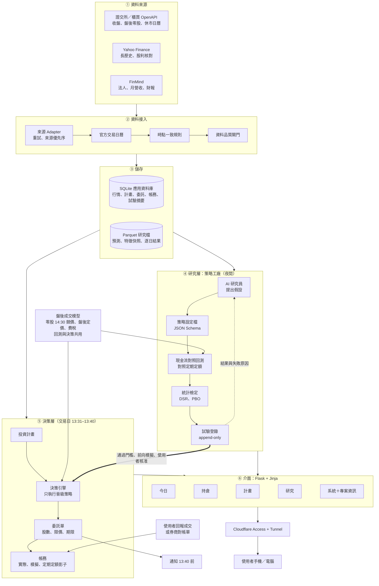
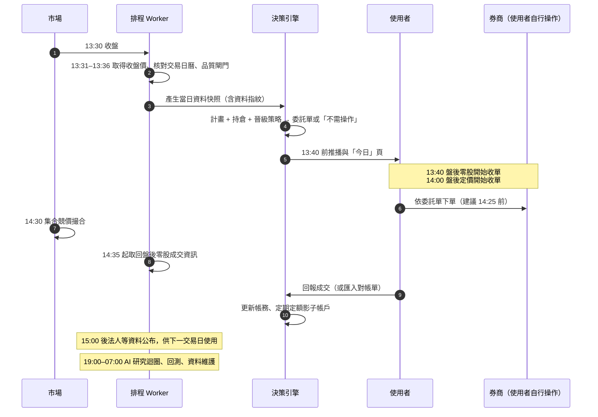
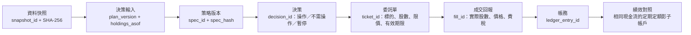
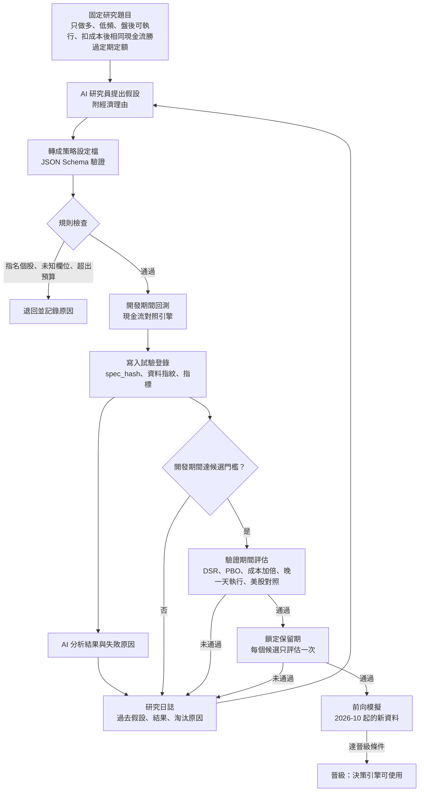
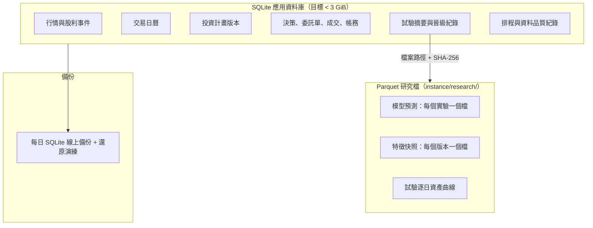
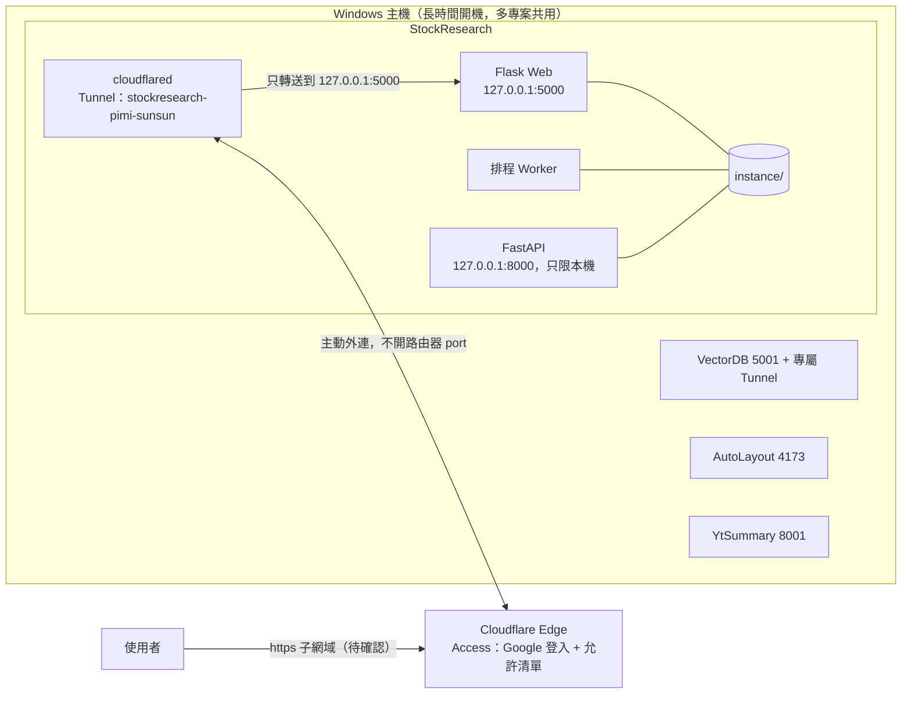

# 盤後決策台 — 系統架構

更新：2026-09-30。本檔描述目標架構、每日流程與部署拓撲；各元件的交付狀態以 [開發路線圖](development_roadmap.md) 為準，需求以根目錄 [`REQUIREMENTS.md`](../REQUIREMENTS.md) 為準。

## 產品目標

單人使用的台股盤後決策台。每個交易日 13:40 前告訴使用者「今天要不要操作、操作什麼、限價多少、為什麼」；14:30 撮合後記錄結果；持續和「相同現金流的定期定額」比較。策略由 AI 研究員在歷史資料上提出與淘汰，只有通過統計門檻與前向模擬的規則才進入每日決策。

## 架構決策

| 編號 | 決策 | 理由 |
|---|---|---|
| D1 | 單人使用；登入交給 Cloudflare Access（Google），網站驗證 Access JWT | 不必維護自建 OAuth、使用者隔離與 CSRF；沿用 VectorDB 已驗證的做法 |
| D2 | 前端使用 Flask + Jinja + HTML，只加少量原生 JS（複製委託、倒數） | 使用者指定；單人工具不需要前端框架 |
| D3 | 行情與應用資料留在 SQLite；模型預測、特徵快照、試驗逐日結果改存 Parquet 檔，資料庫只存摘要與檔案位置 | 2026-09-30 量測：22.3 GiB 主檔中行情只佔 0.13 GiB，預測與特徵（含索引）約佔 18.8 GiB |
| D4 | AI 擔任研究員，不擔任交易員；決策引擎只執行已晉級的規則設定檔 | LLM 訓練資料含歷史行情與新聞，讓 LLM 直接判斷買賣無法誠實回測；規則可機械重現 |
| D5 | 回測、前向模擬與每日建議共用同一套盤後成交模型 | 避免回測與實際執行假設不同 |
| D6 | 真實下單永久關閉；系統產生委託單內容，由使用者在券商自行下單並回報成交 | 安全邊界；也不需保存券商憑證 |
| D7 | 主要評估指標是「相同現金流下相對定期定額」，勝率只作參考 | 勝率高但偶爾大虧的策略會輸給定期定額 |
| D8 | 發布使用本專案專屬 Cloudflare Tunnel，origin 只綁 `127.0.0.1:5000` | 與 VectorDB、AutoLayout、YtSummary 同一台主機，各專案 Tunnel 與程序互不影響 |

## 圖 1：目標架構總覽

## 圖 2：每個交易日的盤後時間軸

目標：13:40 前完成建議；研究與重運算放在晚間，不與決策時段搶資源。

時間點依據：盤後零股 13:40–14:30 收單、14:30 一次集合競價；盤後定價交易 14:00–14:30 收單、以當日收盤價成交。各資料來源的實際可取得時間在 S1-W05 實測後回填本圖。

## 圖 3：決策契約與識別碼鏈

每一步都保存識別碼，任何一筆建議都能回查它用了哪份資料、哪個計畫版本、哪個策略版本。

規則：同一組輸入重跑得到相同決策；建議金額不超過可用現金；未成交不計入持倉；過期委託單不可沿用；資料閘門未通過時輸出「暫停產生新建議」並說明原因，不把既有持倉解讀為必須賣出。

## 圖 4：AI 研究迴圈（策略工廠）

防護：AI 只輸出設定檔，不執行程式；看不到保留期資料；所有試驗（含失敗）都計入多重檢定；研究只在夜間執行並設每日試驗與 API 預算。保留期已在 2026-08 前的研究中被使用過的部分，於路線圖 S4-W02 記錄為已知限制；完全乾淨的驗證是前向模擬。

## 圖 5：資料儲存分層

## 圖 6：部署拓撲

網站在每個請求驗證 `Cf-Access-Jwt-Assertion`（簽章、audience、issuer、email）；本機 loopback 請求可免登入以便開發。Tunnel、憑證與啟動器位於本專案 `.runtime/`，只操作核對過 PID 與命令列的本專案程序。

## 模組現況與處置

| 模組 | 現況 | 處置 | 階段 |
|---|---|---|---|
| 來源 Adapter（證交所、櫃買、Yahoo、FinMind、MOPS） | 可用 | 沿用；補官方交易日曆、2003 年起長歷史、股利事件、盤後零股成交資訊 | S1、S3 |
| 時點一致觀測與修訂 | 可用 | 沿用 | — |
| 資料品質閘門 | 可用；休市日誤報 | 修正交易日判斷，保留阻擋邏輯 | S1 |
| 排程與通知 | 可用；worker 長時間高 CPU | 重新分配時段（決策 13:30–13:40、研究夜間）；補服務啟停腳本 | S1 |
| 特徵與標籤資料庫 | 可用；佔 8.6 GiB | 只保留使用中版本，其餘轉 Parquet | S1 |
| 模型研究（Model Zoo、AutoML） | 可用；預測佔 10.2 GiB | 預測改存 Parquet；ML 只作為挑戰者 | S1、S4 |
| 走動式回測、因子、Regime | 可用 | 保留作參考；主要評估改用現金流對照引擎 | S3 |
| 九種組合配置 | 可用 | 凍結；策略設定檔只提供等權、反波動與目標權重 | S8 |
| `after_hours_ai.py`、`decision_support.py` | 可用；單檔 108 KB、固定權重組分 | 拆解改寫為決策引擎 + 策略設定檔 | S5 |
| 模擬交易狀態機 | 可用 | 沿用；擴充為實際帳戶、前向模擬與定期定額影子帳戶 | S5 |
| Google OAuth 登入 | 可用 | 由 Cloudflare Access 取代，程式於 S8 移除 | S2、S8 |
| 強化學習、影子交易、晉級沙盒、模型治理 | 可用 | 凍結並移出導覽；S8 退場 | S8 |
| RAG 知識庫、新聞情緒 | 可用 | 凍結；需要文字解釋時再評估 | S8 |
| 盤中／衍生品、Google Trends、法說會 | 可用 | 停止排程收集，保留程式；S8 決定去留 | S1、S8 |
| Dashboard（38 個模板） | 資訊過載 | 新介面 5 頁 + 專案資訊；舊頁收進「研究 › 舊版工具」，S8 移除 | S2、S6 |

## 目標程式結構

新程式放在既有 `src/quant_platform/` 內，名稱在各工作包定案：

| 位置 | 內容 |
|---|---|
| `calendar/` | 官方交易日曆與臨時休市 |
| `research/` | 策略設定檔 schema、現金流對照回測引擎、盤後成交模型、試驗登錄、統計檢定、AI 研究員 |
| `decision/` | 投資計畫、決策引擎、委託單、帳務與影子帳戶 |
| `web/` 或 `dashboard/` 新模板 | 今日、持倉、計畫、研究、系統、專案資訊 |
| `access/` | Cloudflare Access JWT 驗證 |
